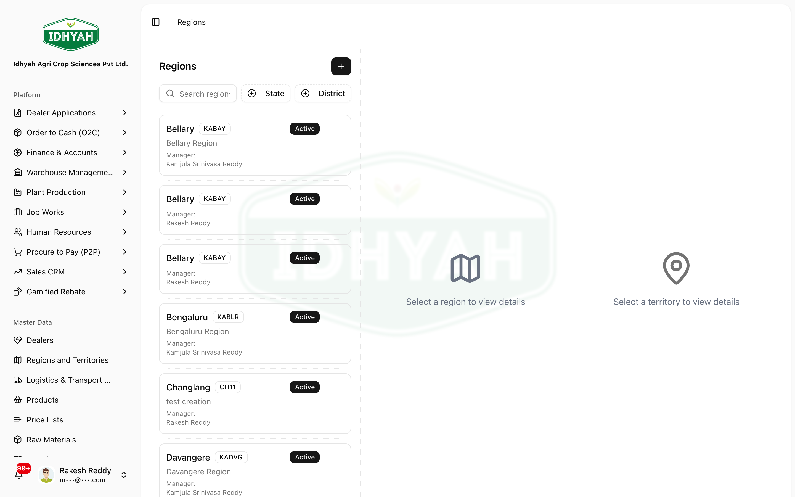

# Regions & Territories

> The sales-geography master: define your **regions** and the **territories** within them, and assign a
> **manager** to each. This structure routes dealers, leads, price-list targeting, and sales targets.

> **Audience:** Customer + Internal · **Module:** `/regions` · **Status:** 🟢 Authored
> **Verified:** against `web_app/src/app/regions` on 2026-06-18.

## What you can do
- **Define regions** — name, code, state, district, description, and a **region manager**.
- **Define territories** under each region — name, code, **territory manager**, and the assigned user.
- **Assign managers** — pick the user who owns each region/territory.
- **Activate / deactivate** regions and territories without losing history.

## Before you begin
- Decide your **two-level geography**: regions at the top, territories beneath each region.
- Have the **users** who will manage each region/territory set up so you can assign them.
- Agree a **coding scheme** for region and territory codes.

### Roles and what each can do

| Role | Typical responsibilities |
|---|---|
| **Sales Admin** | Create & maintain regions and territories; assign managers |
| **Regional Manager** | Owns a region; reads its territories |
| **Territory Manager** | Owns a territory |

<!-- INTERNAL:START -->
Permission-gated on `master_regions` and `master_territories` (create/update; delete actions exist). Tenant-isolated via RLS. Tables: `master_regions`, `master_territories`; manager/user assignment resolves against `profiles`. *(Schema & controls → [Regions & Territories Developer Guide](../../developer-guides/regions.md).)*
<!-- INTERNAL:END -->

### How the geography is structured
```
Region                ── name · code · state · district · region manager
  └─ Territory        ── name · code · territory manager · assigned user
(Used by) Dealers · Leads · Price-list targeting · Sales targets
```

---

## Key workflows

### Create a region
**Role:** Sales Admin · **Result:** a region ready for territories
1. **Regions → Add Region** — enter **name**, **code**, **state**, **district**, a description, and pick the **region manager**.
   
   <!-- capture: { "project": "iacs-md", "route": "/regions" } -->
2. Save — the region appears in the list, ready to hold territories.

### Add territories
**Role:** Sales Admin · **Result:** territories that route work to managers
1. Open the region and **Add Territory** — enter name, code, the **territory manager**, and the **assigned user**.
2. Repeat for each territory in the region.
> **Tip** Assign the **right manager/user** to each territory — this is what routes leads, dealers, and targets to the correct person.

### Edit, deactivate
**Role:** Sales Admin · **Result:** structure stays current without losing history
1. **Edit** a region or territory to change details or reassign a manager.
2. **Deactivate** (rather than delete) a region/territory you no longer use — history and past assignments are preserved.
> **Caution** Deactivating or deleting a region/territory that still has dealers, leads, or open targets attached can leave those records unrouted — reassign first.

---

## Pages & areas

| Area | Where | What you do there |
|---|---|---|
| **Regions list** | Regions | Browse regions, add a region |
| **Region detail** | Regions → (a region) | Edit region, manage its territories |
| **Territory detail** | Region → (a territory) | Edit territory, set manager/user |

---

## Common use cases
- **Stand up the sales map** — create regions → add territories → assign managers, before onboarding dealers or running targets.
- **Reorganise** — reassign a territory's manager, or move which user owns it.
- **Retire an area** — deactivate a region/territory after reassigning its dealers and targets.

## Reference
- **Hierarchy:** Region → Territory (two levels).
- **Each level** carries a manager; territories also carry an assigned user.
- **Consumers:** Dealers, Leads, Price-list targeting, Sales targets.
<!-- INTERNAL:START -->Tables: `master_regions`, `master_territories`; managers resolved via `profiles`. Schema → [Developer Guide](../../developer-guides/regions.md).<!-- INTERNAL:END -->

## Troubleshooting
| What you see | Why it happens | How to fix it |
|---|---|---|
| A territory has no manager | Manager/user not assigned | Edit the territory and assign one |
| Leads/dealers aren't routing | Wrong or missing territory assignment | Fix the territory or the record's territory |
| Can't deactivate a region | It still has active territories/records | Reassign or deactivate the children first |
| A user isn't selectable as manager | The user isn't set up / lacks access | Set up the user first, then assign |

## Support and escalation
- **Geography setup / manager assignment** → Sales Admin.
- **Routing issues** → Regional Manager.

## Related workflows
[Dealers](../dealers/README.md) · [Sales CRM](../sales-crm/README.md) · [Price Lists](../price-lists/README.md)
