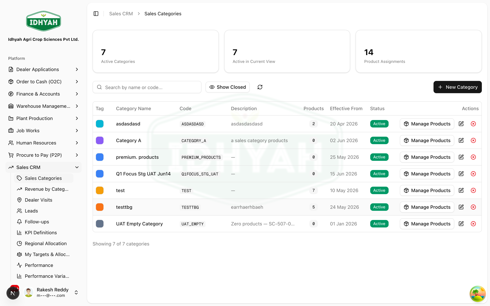
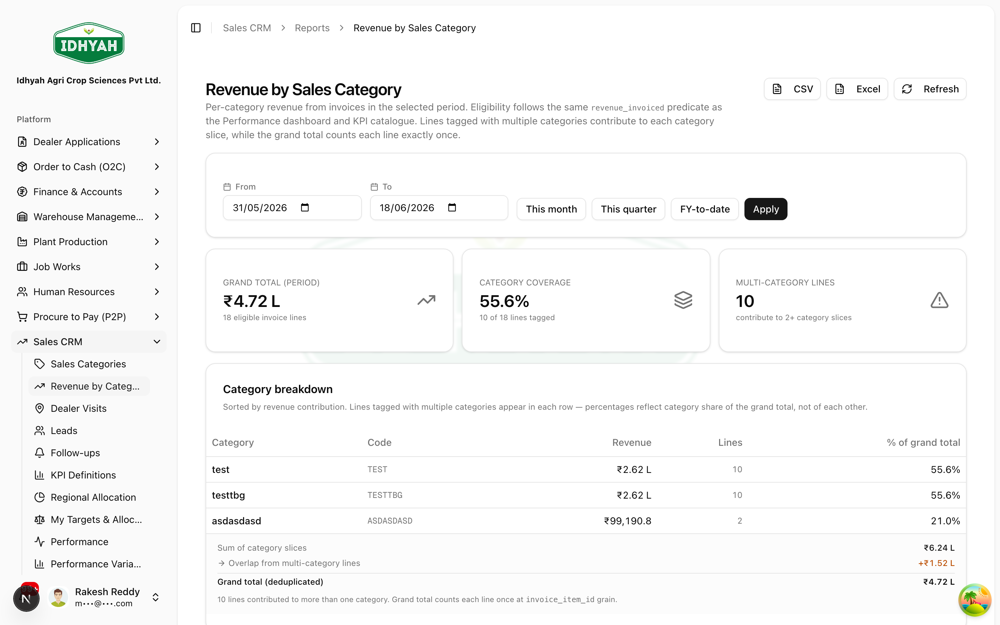
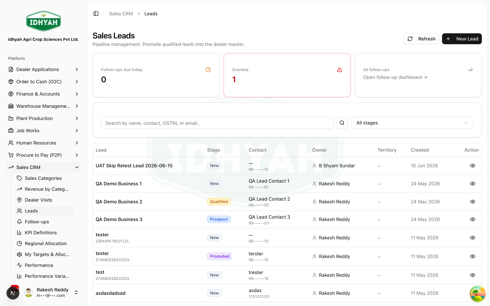

# Sales CRM

> Run the sell-side relationship: classify products into sales categories, work a dealer pipeline
> (leads → visits → follow-ups → promote), and set & track sales targets across the organisation.

> **Audience:** Customer + Internal · **Module:** `/sales-crm` · **Status:** 🟢 Authored
> **Verified:** against `web_app/src/app/sales-crm` + staging DB on 2026-06-18.

## What you can do
- **Product Sales Categories** — group products into sales categories for analysis and targets (effective-dated).
- **Leads & Pipeline** — capture prospective dealers, record **dealer visits**, schedule **follow-ups**, and **promote** a qualified lead into a live dealer.
- **Target Management** — set a **budget cycle**, cascade targets through regions and territories, and track **performance and variance** against plan.
- **KPIs & Reporting** — define the KPIs you measure on; report **revenue by category**.

## Before you begin
- **Products** exist (to assign to categories) and your **sales structure** (regions/territories) is set up.
- The **sales team** and their roles are configured.
- **KPI Definitions** are set for the metrics you plan and measure on.

### Roles and what each can do

| Role | Typical responsibilities |
|---|---|
| **Sales Admin** | Maintain sales categories, KPI definitions |
| **Territory Manager (TM) / Field Sales** | Create leads, log dealer visits & follow-ups, build **My Sales Plan** |
| **Regional Manager (RM)** | Oversee the pipeline; allocate & consolidate regional targets |
| **Sales Head (SH)** | Open the budget cycle, distribute budget, run the final review/sign-off |

<!-- INTERNAL:START -->
Access is permission-gated (`sales_crm`, `sales_categories`, `sales_category_assignments`, `leads`, `sales_crm_visits`, `target_management`, `tm_sales_plans`, `rm_regional_consolidations`, `budget_regional_distributions`, `kpi`, `sales_reports`) and tenant-isolated via RLS. Lead promotion matches against existing records and creates a `master_dealers` row. *(Tables, lifecycle, controls → [Sales CRM Developer Guide](../../developer-guides/sales-crm.md).)*
<!-- INTERNAL:END -->

### How Sales CRM is organised
```
Catalogue  ── Product Sales Categories · Revenue by Category
Pipeline   ── Leads → Dealer Visits → Follow-ups → Promote to Dealer
Targets    ── Budget Cycle → Regional Distribution → RM Consolidation → My Sales Plan → My Targets
Measure    ── KPI Definitions · Performance · Performance Variance · SH Final Review
```

---

## Key workflows

### Classify products into sales categories
**Role:** Sales Admin · **Result:** products grouped for analysis & targets
1. **Sales CRM → Sales Categories** — create a category, then assign products with an **effective-from** date (history is preserved as versions).
   
2. Review sales rolled up by category in **Reports → Revenue by Category**.
   
> **Tip** Set the **effective-from** date when re-assigning products so past reports stay accurate. Full detail: see *Sales Categories* below.

### Work the dealer pipeline (leads → promote)
**Role:** TM / RM · **Result:** qualified prospects converted to dealers
1. **Leads → New** — capture a prospect (business, contact, territory). Status flows **New → Prospect → Qualified → Promoted** (or **Cancelled**).
   
2. On the lead, **log dealer visits** and set **follow-ups** so nothing is dropped.
   
   
3. When ready, **Promote** the lead — DAEE matches against existing records and creates the **dealer**, with no re-keying.
> **Caution** Review the **match suggestions** when promoting — promoting a lead that's already a dealer creates duplicates.

### Set & track sales targets
**Roles:** SH → RM → TM · **Result:** cascaded targets with live performance tracking
1. **Sales Head** opens a **Budget Cycle** and **distributes** the budget to regions.
   
   
2. **Regional Managers** allocate and **consolidate**; **Territory Managers** build **My Sales Plan** → **My Targets**.
   
3. Everyone tracks **Performance** vs target and acts on **Performance Variance**; the Sales Head **seals** the plan in the final review.
   
> **Caution** Plan **top-down, in order** (SH → RM → TM). Once the cycle is **sealed**, plans are fixed for the period.

---

## Feature list (every Sales CRM page)

The complete page inventory, matching the app sidebar. Labels are the exact **sidebar titles**.

### Catalogue & reporting
| Feature (sidebar) | Route | Role | What it does |
|---|---|---|---|
| **Sales Categories** | `/sales-crm/sales-categories` | Sales Admin | Group products into **effective-dated** sales categories for analysis and targeting; assign products with an effective-from date (versioned history). |
| **Revenue by Category** | `/sales-crm/reports/revenue-by-category` | Sales / RM | Report **actual sales rolled up by sales category** over a period. |

### Dealer pipeline (CRM)
| Feature (sidebar) | Route | Role | What it does |
|---|---|---|---|
| **Leads** | `/sales-crm/leads` | TM / RM | Capture and progress prospective dealers (**New → Prospect → Qualified → Promoted / Cancelled**); **promote** a qualified lead into a `master_dealers` record. |
| **Dealer Visits** | `/sales-crm/visits` | TM / Field Sales | Log **field visits** to leads/dealers — purpose, outcome, and next action. |
| **Follow-ups** | `/sales-crm/followups` | TM / RM | Schedule and track **follow-up actions** raised from leads and visits so nothing is dropped. |

### Target Management — planning cascade (top-down: SH → RM → TM)
| Feature (sidebar) | Route | Role | What it does |
|---|---|---|---|
| **Budget Cycles** | `/sales-crm/target-management/budget-cycles` | Sales Head | Open and manage a **planning cycle** (period + status) — the container every plan hangs off. |
| **Budget Distribution** | `/sales-crm/target-management/budget-distribution` | Sales Head | **Distribute** the top-line budget down to regions for the open cycle. |
| **Regional Allocation** | `/sales-crm/target-management/regional-allocation` | Regional Manager | Allocate a region's distributed budget across its **territories**. |
| **My Sales Plan** | `/sales-crm/target-management/my-sales-plan` | Territory Manager | Build the **bottom-up** territory plan (by category / KPI / period). |
| **Regional Consolidations** | `/sales-crm/target-management/rm-consolidation` | Regional Manager | **Consolidate** territory plans into one regional submission for review. |
| **My Targets & Allocation** | `/sales-crm/target-management/my-targets` | TM / RM | View the **targets assigned to you** and their allocation across the period. |
| **Demand Forecast** | `/sales-crm/target-management/demand-forecast` | Sales / RM | Forecast demand that **informs** the plan and targets. |
| **SH Final Review** | `/sales-crm/target-management/sh-final-review` | Sales Head | Review the consolidated cycle and **seal / sign off** — sealing fixes plans for the period. |

### Measurement & KPIs
| Feature (sidebar) | Route | Role | What it does |
|---|---|---|---|
| **KPI Definitions** | `/sales-crm/target-management/kpi-catalogue` | Sales Admin | Define the **KPIs** the org plans and measures on (the metric catalogue). |
| **Performance** | `/sales-crm/target-management/performance` | All | Track **actuals vs target** across the cycle. |
| **Performance Variance** | `/sales-crm/target-management/performance-variance` | RM / SH | Analyse **variance vs plan** and act on it. |

> **Coverage status.** This page lists **all 16 features**. Detailed step-by-step guides + screenshots
> exist today for **Sales Categories, Leads, Dealer Visits, Budget Cycles/Distribution, My Sales Plan,
> Performance, KPI Definitions**. Deep guides for **Follow-ups, Regional Allocation, My Targets, Regional
> Consolidations, Performance Variance, SH Final Review, and Demand Forecast** are the next documentation
> batch (see the plan).

---

## Common use cases
- **Onboard a prospect end-to-end** — lead → visits/follow-ups → qualify → promote to dealer → (dealer onboarding/setup).
- **Plan a sales cycle** — budget cycle → distribute → RM consolidate → TM plans → seal → track performance.
- **Analyse by product line** — tag products to categories → revenue-by-category and category targets.

## Reference
- **Lead lifecycle:** New → Prospect → Qualified → Promoted (or Cancelled).
- **Target cascade:** Budget Cycle → Regional Distribution → RM Consolidation → My Sales Plan → My Targets → Performance/Variance → SH Final Review (sealed).
<!-- INTERNAL:START -->Tables: `sales_categories`, `sales_category_assignments`, `leads`, `lead_meetings`, `lead_followups`, `lead_stage_history`, `sales_crm_visits`, `budget_cycles`, `budget_regional_distributions(+_lines)`, `rm_regional_consolidations`, `tm_sales_plans(+_lines)`, `sales_targets`, `kpi_catalogue`, `kpi_signoffs`. Schema → [Developer Guide](../../developer-guides/sales-crm.md).<!-- INTERNAL:END -->

## Troubleshooting
| What you see | Why it happens | How to fix it |
|---|---|---|
| A product isn't in category revenue | It isn't assigned to any sales category | Assign it (with an effective date) |
| Promoting a lead is blocked / warns | A possible duplicate dealer was matched | Review the match; only promote genuinely new prospects |
| Can't build a sales plan | The budget cycle isn't distributed to your level yet | Wait for the upper level (SH → RM) to distribute first |
| A KPI can't be planned/measured | It isn't in **KPI Definitions** | Add the KPI definition first |

## Support and escalation
- **Categories / KPI setup** → Sales Admin.
- **Pipeline / promotion** → Regional Manager; **dealer setup after promotion** → Sales Admin.
- **Budget cycle / sign-off** → Sales Head.

## Related workflows
[Dealers](../dealers/README.md) (a promoted lead becomes a dealer) · [Order to Cash (O2C)](../o2c/order-to-cash.md) (the dealer's orders).

> **Note** Target Management's exact **sign-off / seal / re-open** mechanics are still being finalised; confirm the precise approval steps with your Sales Head before a live planning cycle.
