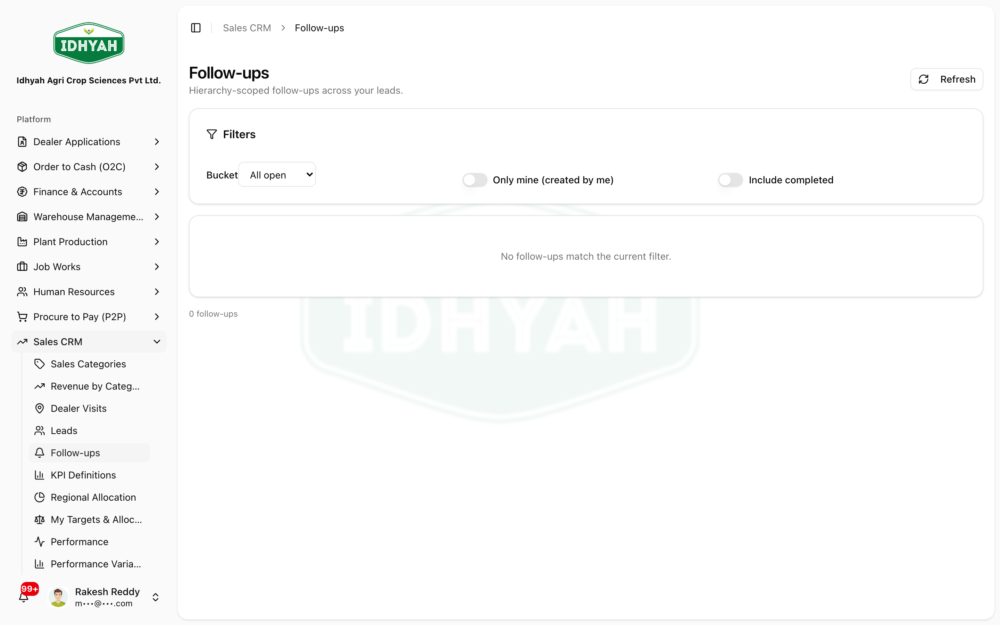

# Follow-ups — in detail

> Your **to-do board** for the pipeline: the follow-up actions raised on leads (and visits), with what's
> **due** and **upcoming**, so nothing gets dropped between contacts.

> **Audience:** Customer + Internal · **Module:** `/sales-crm/followups` · **Status:** 🟢 Authored
> **Verified:** against `web_app/src/app/sales-crm/followups` + `leads/actions` on 2026-07-07.

Part of **[Sales CRM](./README.md)**. Follow-ups are raised from [Leads](./README.md#work-the-dealer-pipeline-leads-promote) and [Dealer Visits](./visits.md).

## What this is for
A **Follow-up** is a dated next action on a lead (call back, send quote, revisit). The **Follow-ups** page is
your consolidated **My Follow-ups** view — everything assigned to you, bucketed by **due / upcoming**, so you
work the pipeline without losing threads.

## Who does this
| Role | What they do |
|---|---|
| **Territory Manager / Field Sales** | Raise follow-ups on leads/visits; work and close their own |
| **Regional Manager** | See open follow-ups across the region for coverage |

## Step-by-step

### 1. Raise a follow-up (from a lead)
On a **lead** (or after logging a **[visit](./visits.md)**), **add a follow-up** with a **due date** and a
note on the next action.

### 2. Work your board
**Sales CRM → Follow-ups** shows **My Follow-ups** with **due** and **upcoming** counts. Open one to act on it.

<!-- capture: { "project": "iacs-md", "route": "/sales-crm/followups" } -->

### 3. Close it out
- **Mark done** when the action is complete (it drops off your due list); **undo** if you closed it by mistake.
- Raising the *next* follow-up as you close one keeps the thread alive to the next contact.

## Expected result
- A single, dated to-do list of pipeline actions per rep — nothing dropped between visits.
- Managers can see open follow-ups as a coverage signal.

## Common mistakes & warnings
- **No due date** — a follow-up without a date won't surface as "due"; always set one.
- **Closing without the next step** — if more contact is needed, raise the next follow-up before marking done.

<!-- INTERNAL:START -->
Table `lead_followups` (surfaced per-user by `fetchMyFollowups` + `fetchFollowupCounts`). Actions:
`createLeadFollowup`, `fetchLeadFollowups`, `fetchMyFollowups`, `fetchFollowupCounts`, `markFollowupDone`,
`undoFollowupDone`. Leads also carry `lead_meetings` (`createLeadMeeting`/`fetchLeadTimeline`).
Permission-gated (`leads`) + tenant/view-scope isolated. *(Schema → [Sales CRM Developer Guide](../../developer-guides/sales-crm.md).)*
<!-- INTERNAL:END -->

## Related workflows
[Sales CRM](./README.md) · [Dealer Visits](./visits.md) · [Dealers](../dealers/README.md)

## Support and escalation
Pipeline coverage → **Regional Manager**. Access/scope issues → **Sales Admin**.
