# Target Management — in detail

> The **sales planning cascade**: the Sales Head opens a **budget cycle** and distributes the budget to
> regions; Regional Managers allocate to territories and consolidate; Territory Managers build their sales
> plans; the Sales Head reviews and **seals** the cycle. Then everyone tracks **performance vs target** —
> all measured on the **KPIs** you define.

> **Audience:** Customer + Internal · **Module:** `/sales-crm/target-management` · **Status:** 🟢 Authored
> **Verified:** against `web_app/src/app/sales-crm/target-management` on 2026-07-07.

Part of **[Sales CRM](./README.md)**.

## What this is for
Target Management turns a top-line number into **committed, cascaded targets** and then tracks delivery
against them. It is **top-down to plan, bottom-up to commit, top-down to seal**:

```
Budget Cycle (SH)  →  Budget Distribution (SH → regions)  →  Regional Allocation (RM → territories)
        ↓
My Sales Plan (TM, bottom-up)  →  RM Consolidation (RM rolls up TM plans)  →  SH Final Review (seal/lock)
        ↓
My Targets & Allocation (what you're committed to)  →  Performance + Variance (delivery vs target)

Measured on: KPI Definitions   ·   Informed by: Demand Forecast
```

> **Plan in order.** A level can only act once the level above has released to it (SH distributes before RM
> allocates; the cycle must be **open** before plans can be built; once **sealed**, plans are fixed).

## Who does this
| Role | Owns |
|---|---|
| **Sales Head (SH)** | Budget Cycle · Budget Distribution · SH Final Review (seal / re-open approval) |
| **Regional Manager (RM)** | Regional Allocation · Regional Consolidations |
| **Territory Manager (TM)** | My Sales Plan · My Targets |
| **Sales Admin** | KPI Definitions |

---

## 1. Budget Cycle (Sales Head)
**Sales CRM → Budget Cycles.** The cycle is the **container** every plan hangs off — a period with a status
that moves **Draft → In progress → Submitted → Finalized**.
1. **Initiate a budget cycle** — set the **period** (fiscal window) and the top-line budget basis.
2. The cycle opens as **In progress**, which unlocks distribution and planning below it. **Cancel** a cycle
   only before plans are built against it.
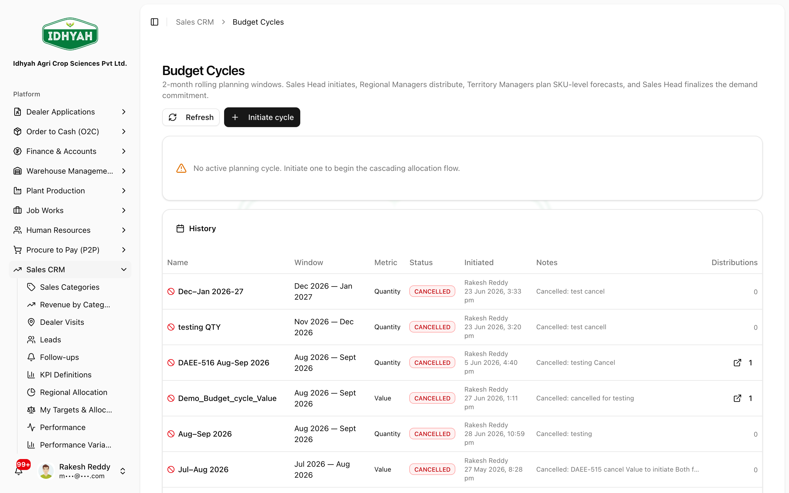
<!-- capture: { "project": "iacs-md", "route": "/sales-crm/target-management/budget-cycles" } -->

## 2. Budget Distribution (Sales Head)
**Target Management → Budget Distribution.** Split the top-line budget **down to regions** for the open cycle.
1. **Create a distribution draft**, enter each region's share (the lines must reconcile to the cycle total).
2. **Submit** the distribution — this releases the regional numbers to the RMs.
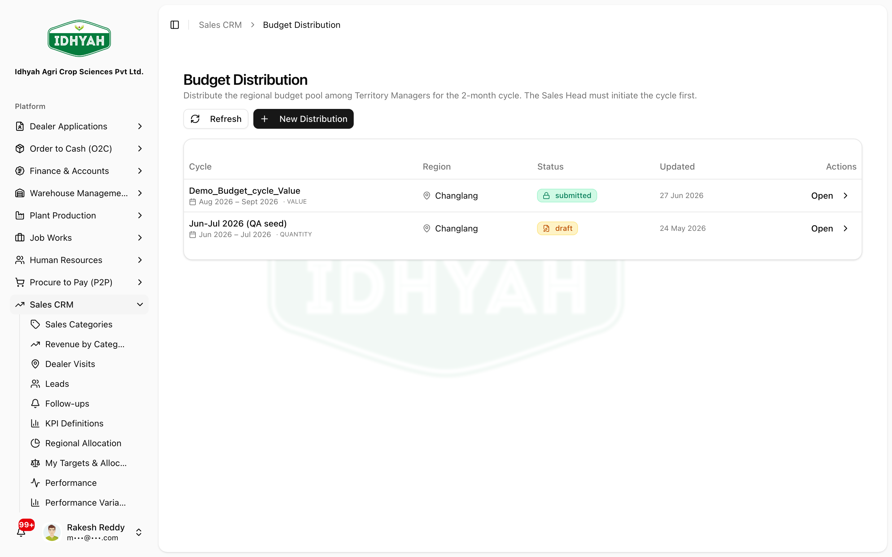
<!-- capture: { "project": "iacs-md", "route": "/sales-crm/target-management/budget-distribution" } -->

## 3. Regional Allocation (Regional Manager)
**Target Management → Regional Allocation.** Allocate the region's distributed budget **across its
territories**, so each TM has a number to plan against.
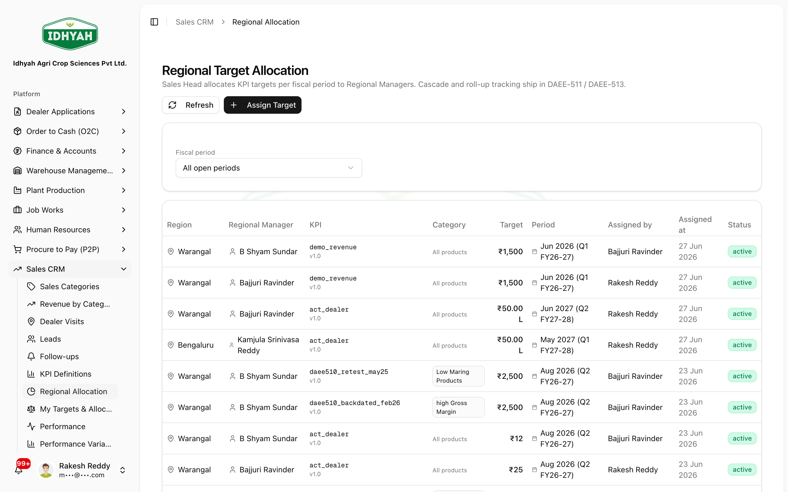
<!-- capture: { "project": "iacs-md", "route": "/sales-crm/target-management/regional-allocation" } -->

## 4. My Sales Plan (Territory Manager)
**Target Management → My Sales Plan.** The TM's **bottom-up** plan for their territory (by category / KPI /
period).
1. **Create a plan draft**, enter the planned numbers, and refine.
2. **Submit** the plan up to the RM (or **Discard** the draft to start over).
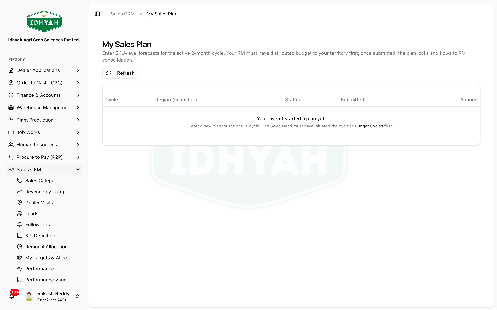
<!-- capture: { "project": "iacs-md", "route": "/sales-crm/target-management/my-sales-plan" } -->

## 5. Regional Consolidations (Regional Manager)
**Target Management → Regional Consolidations.** The RM **rolls up** the territory plans into one regional
submission.
1. **Create a consolidation draft** — it gathers the submitted TM plans.
2. **Adjust** where needed; if a TM hasn't submitted, **force-submit** that plan (single or bulk) so the
   region isn't blocked.
3. **Submit the consolidation** up to the Sales Head (or **Discard**).
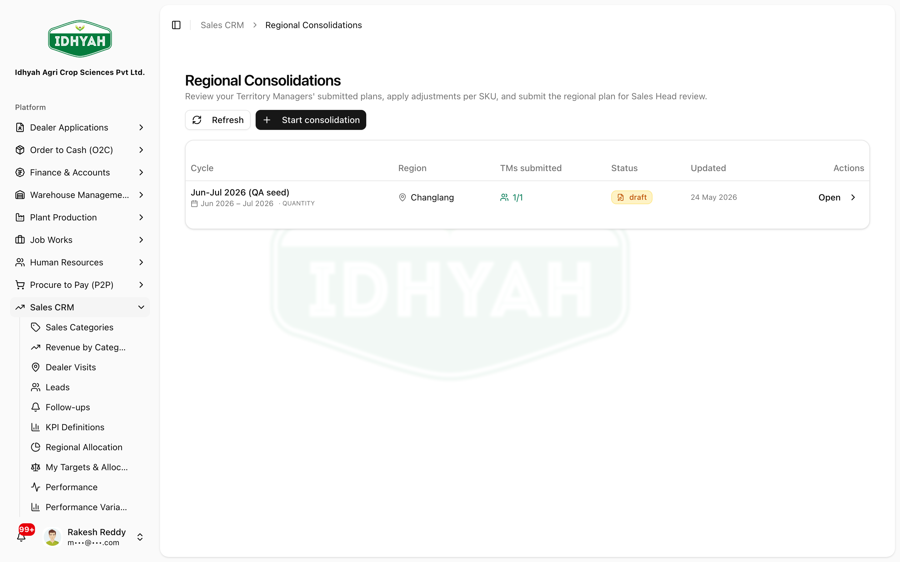
<!-- capture: { "project": "iacs-md", "route": "/sales-crm/target-management/rm-consolidation" } -->

## 6. My Targets & Allocation (TM / RM)
**Target Management → My Targets & Allocation.** The **read view** of what you're committed to for the
cycle — your targets and how they're allocated across the period / sub-targets.
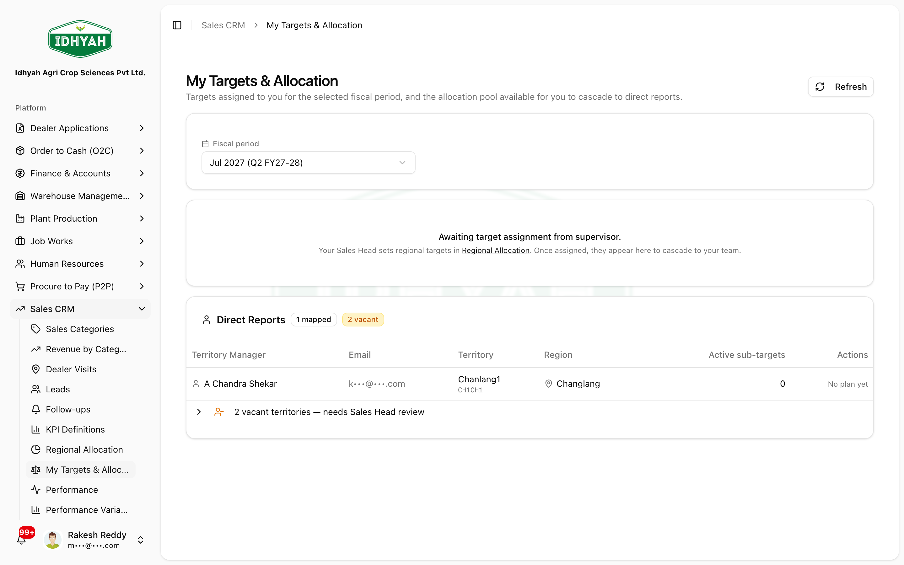
<!-- capture: { "project": "iacs-md", "route": "/sales-crm/target-management/my-targets" } -->

## 7. SH Final Review — seal & re-open (Sales Head)
**Target Management → SH Final Review.** The Sales Head reviews the consolidated cycle and **seals** it.
1. **Start SH review** on the cycle, then **set SH final** figures where required.
2. If a region never consolidated, **force-consolidate missing regions** so the cycle is complete.
3. **Finalize → Lock** the cycle. **Locking seals the plan** — targets are fixed for the period.
   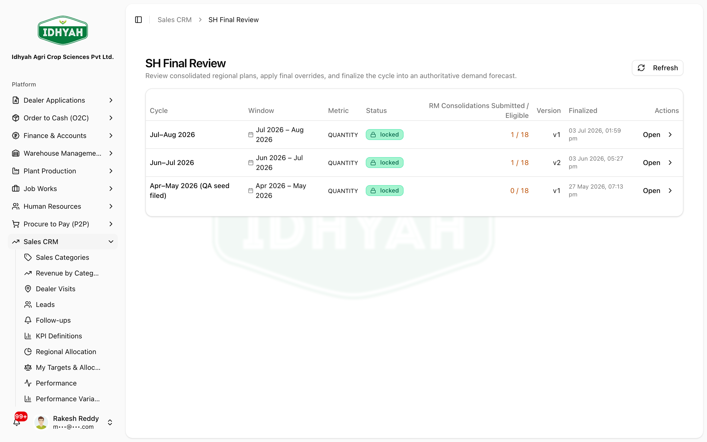
   <!-- capture: { "project": "iacs-md", "route": "/sales-crm/target-management/sh-final-review" } -->
4. **Re-open (governed)** — if a sealed cycle must change, a manager **requests a re-open**; the Sales Head
   **approves or rejects** it. Only an approved re-open unlocks the cycle for edits — so post-seal changes
   are always authorised and audited.

> **Caution** Locking is the commitment point. Everything downstream (My Targets, Performance) reads the
> sealed figures — change them only through the **request → approve** re-open flow.

---

## Measurement

### 8. Performance & Performance Variance
- **Performance** (`/…/performance`) — **actuals vs target** across the cycle, per region/territory/KPI.
- **Performance Variance** (`/…/performance-variance`) — the **gap to plan** (favourable / adverse), so you
  can act on the biggest misses.
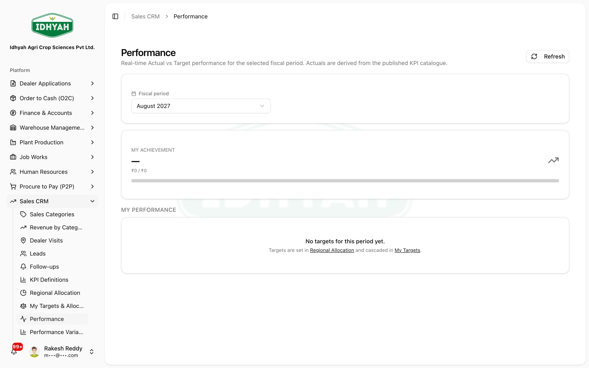
<!-- capture: { "project": "iacs-md", "route": "/sales-crm/target-management/performance" } -->

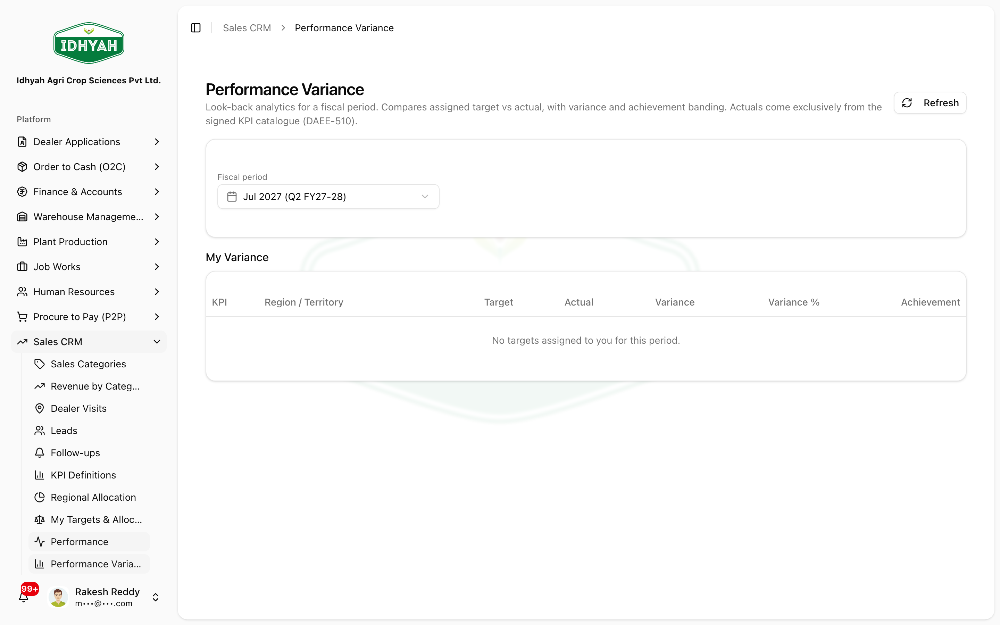
<!-- capture: { "project": "iacs-md", "route": "/sales-crm/target-management/performance-variance" } -->

### 9. KPI Definitions
**Target Management → KPI Definitions.** The **catalogue of metrics** you plan and measure on. You can only
plan/measure a KPI that's defined here.
1. **Create a KPI definition** (name, unit, how it's computed).
2. **Sign** it off to make it usable, and **retire** it when it's no longer measured (history preserved).
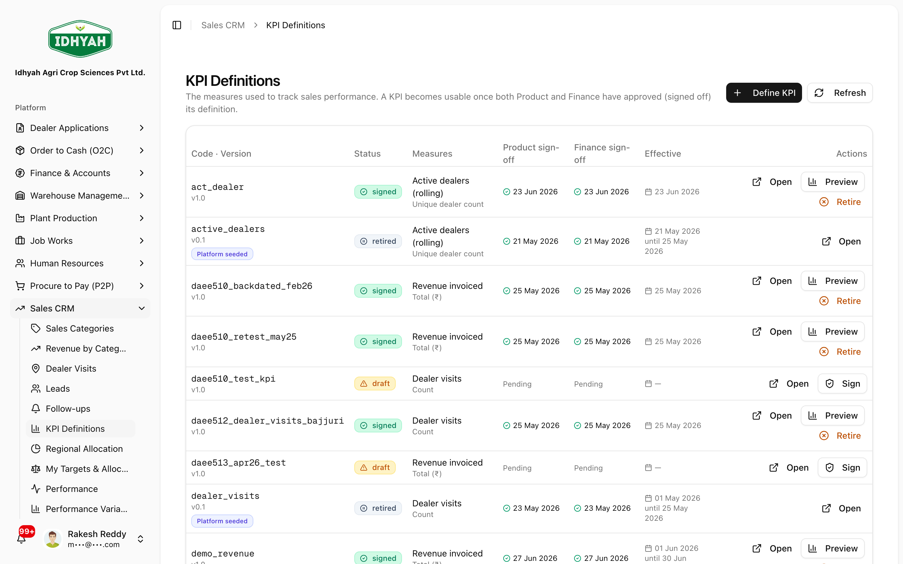
<!-- capture: { "project": "iacs-md", "route": "/sales-crm/target-management/kpi-catalogue" } -->

### 10. Demand Forecast
**Target Management → Demand Forecast.** **Generate a forecast** that informs the plan (and export it to
CSV). It's an input to planning, not a committed target.
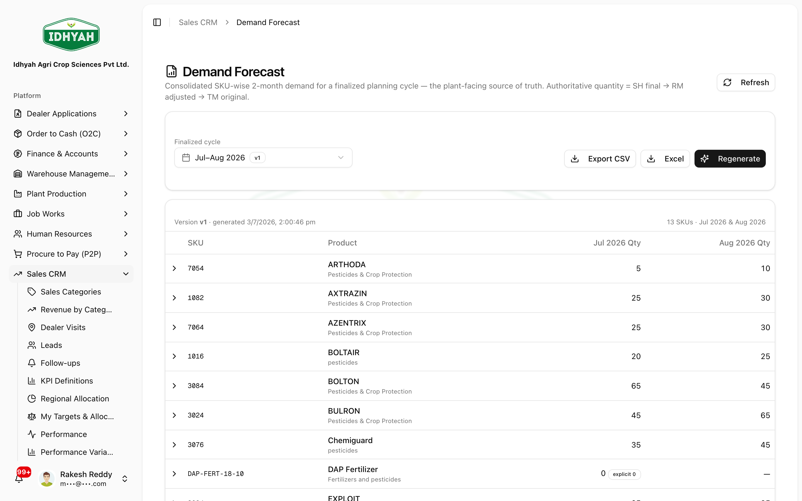
<!-- capture: { "project": "iacs-md", "route": "/sales-crm/target-management/demand-forecast" } -->

---

## Common mistakes & warnings
- **Planning out of order** — a TM can't plan before the SH distributes and the RM allocates. Wait for the
  level above.
- **Editing after seal** — blocked by design; use the **re-open request → approval** flow.
- **Measuring an undefined KPI** — add it to **KPI Definitions** (and sign it off) first.
- **A region stuck un-consolidated** — the RM can **force-submit** missing TM plans; the SH can
  **force-consolidate** missing regions at final review.

<!-- INTERNAL:START -->
Tables: `budget_cycles` (status draft→in_progress→submitted→finalized), `budget_regional_distributions(+_lines)`,
`rm_regional_consolidations`, `tm_sales_plans(+_lines)`, `sales_targets`, `kpi_catalogue`, `kpi_signoffs`.
Key actions: `initiateBudgetCycle`/`cancelBudgetCycle`; `createDistributionDraft`/`submitDistribution`;
`createTmPlanDraft`/`submitTmPlan`/`discardTmPlan`; `createConsolidationDraft`/`updateConsolidationAdjustments`/
`forceSubmitTmPlan`/`bulkForceSubmitTmPlans`/`submitConsolidation`/`discardConsolidation`;
`startShReview`/`setCycleShFinal`/`finalizeBudgetCycle`/`lockCycle`/`forceConsolidateMissingRegions`;
re-open governance `requestCycleReopen`/`approveCycleReopen`/`rejectCycleReopen`; `createKpiCatalogue`/
`signKpiCatalogue`/`retireKpiCatalogue`/`computeKpiActual`; `generateForecast`/`exportForecastCSV`.
Permission-gated (`target_management`, `tm_sales_plans`, `rm_regional_consolidations`,
`budget_regional_distributions`, `kpi`) and tenant-isolated via RLS. Fiscal-period alignment via
`shared/fiscalPeriodFilter.ts`. *(Full schema & controls → [Sales CRM Developer Guide](../../developer-guides/sales-crm.md).)*
<!-- INTERNAL:END -->

## Related workflows
[Sales CRM](./README.md) · [Regions & Territories](../regions/README.md) (the cascade structure) · [Dealers](../dealers/README.md) · [Order to Cash](../o2c/order-to-cash.md)

## Support and escalation
Cycle / distribution / seal / re-open → **Sales Head**. Regional allocation & consolidation → **Regional
Manager**. Plan building → **Territory Manager**. KPI setup → **Sales Admin**.
