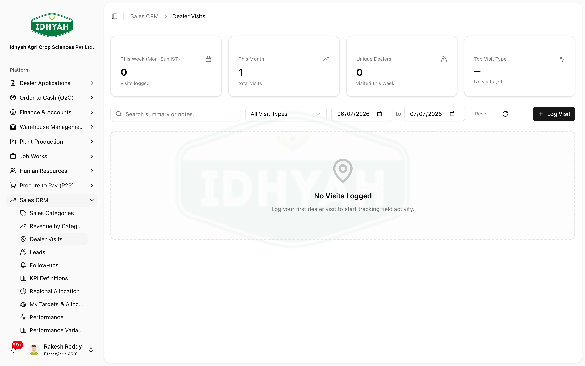

# Dealer Visits — in detail

> Log **field visits** to dealers and prospects — what the visit was for, what happened, and the next
> action — so the pipeline reflects real activity on the ground.

> **Audience:** Customer + Internal · **Module:** `/sales-crm/visits` · **Status:** 🟢 Authored
> **Verified:** against `web_app/src/app/sales-crm/visits` on 2026-07-07.

Part of **[Sales CRM](./README.md)**. Related: [Leads](./README.md#work-the-dealer-pipeline-leads-promote) · [Follow-ups](./followups.md).

## What this is for
A **Dealer Visit** records a field interaction with a dealer (or a lead's prospect): the **date**, the
**type** of visit, its **purpose and outcome**, and any **next action**. Visits give managers a real view of
coverage and feed the pipeline.

## Who does this
| Role | What they do |
|---|---|
| **Territory Manager / Field Sales** | Log their visits; set the follow-up |
| **Regional Manager** | Review visit coverage across the region |

## Step-by-step

### 1. Log a visit
**Sales CRM → Dealer Visits → New.** Pick the **dealer** (or the lead's business), set the **visit date** and
**visit type**, and record the **purpose / outcome** and any **next action**.

<!-- capture: { "project": "iacs-md", "route": "/sales-crm/visits" } -->

### 2. Track and close out
- A visit is **Completed** when logged, or **Cancelled** if it didn't happen.
- Raise a **[Follow-up](./followups.md)** from the visit so the next action isn't dropped.
- The list is **scoped to what you can see** (your territory / region), with a summary of recent activity.

## Expected result
- A dated, typed record of every field visit, attributable to the rep, visible to their manager.
- Next actions captured as follow-ups so nothing stalls.

## Common mistakes & warnings
- **Logging a visit with no next action** — if there's a follow-up, raise it so it appears on the follow-ups
  board.
- **Wrong dealer/lead** — the visit attaches to that record's history; pick the right one.

<!-- INTERNAL:START -->
Table `sales_crm_visits` (status completed/cancelled; `visit_date`, `visit_type`). Actions:
`createSalesCrmVisit`, `fetchSalesCrmVisits`, `fetchSalesCrmVisitById`, `fetchSalesCrmVisitSummary`,
`fetchDealerOptionsForVisit`, `fetchMyVisitScopeSummary`, `getSalesCrmVisitAuditOperations`.
Permission-gated (`sales_crm_visits`) + tenant/view-scope isolated. *(Schema → [Sales CRM Developer Guide](../../developer-guides/sales-crm.md).)*
<!-- INTERNAL:END -->

## Related workflows
[Sales CRM](./README.md) · [Follow-ups](./followups.md) · [Dealers](../dealers/README.md)

## Support and escalation
Visit data / coverage → **Regional Manager**. Access/scope issues → **Sales Admin**.
