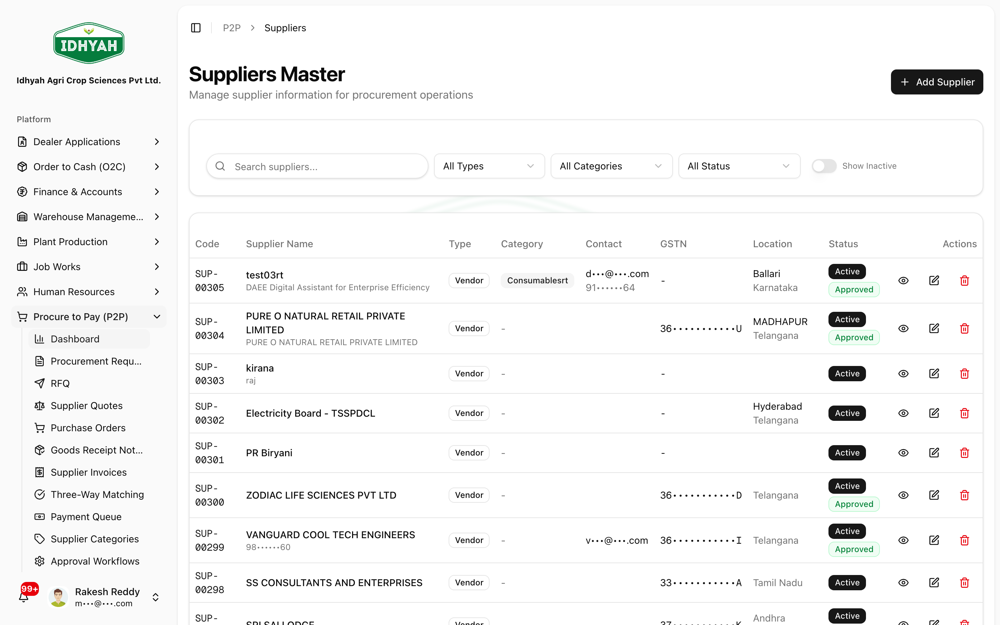
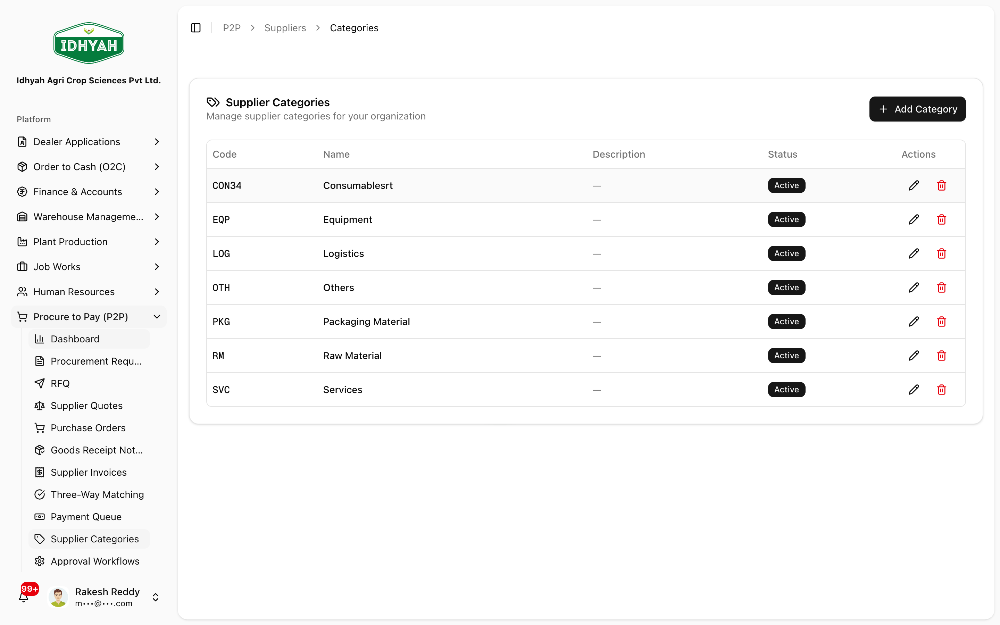

# Suppliers

> Your supplier (vendor) master — who you buy from, their GST/tax profile, payment terms, and bank
> details. Every Procure-to-Pay document and supplier payment references these records.

> **Audience:** Customer + Internal · **Module:** `/p2p/suppliers` · **Status:** 🟢 Authored
> **Verified:** against `web_app/src/app/p2p/suppliers` + staging DB on 2026-06-17.

## What you can do
- **Find & view** any supplier (GSTIN, PAN, category, payment terms, ratings, status).
- **Add & maintain** suppliers, with **GSTIN verification** against the GST portal.
- **Capture the tax profile** — GST registration type, composition/SEZ flags, **MSME** registration, **TDS** section/rate.
- **Hold bank details** for payments, and rate suppliers on **quality** and **delivery**.
- **Classify** suppliers with **categories** for sourcing and reporting.

## Before you begin

### What you need
- The supplier's **GSTIN** (15-digit) — verified against the government GST portal; **inactive** registrations are flagged.
- **PAN**, registered **address** and **state**, **bank account** details, and agreed **payment terms**.
- Their tax profile where applicable: **MSME** registration, **TDS** section/rate, GST **registration type** (regular / composition / SEZ).

### Roles and what each can do

| Role | What they can do |
|---|---|
| **Procurement / Admin** | Create and maintain suppliers and categories |
| **Approver** | Mark a supplier **approved** for transacting |
| **Accounts Payable (Finance)** | Use suppliers for invoices, payments, and the supplier ledger (read) |

<!-- INTERNAL:START -->
**Permissions:** `suppliers:read|create|update|delete`, `supplier_bank_accounts:read|update`. GSTIN is verified via the `gstn-verification` edge function. Tenant-isolated via RLS. Table: `suppliers` (+ `supplier_bank_accounts`, `supplier_categories`, `vendor_posting_groups` for GL). *(Schema, fields, services → [P2P Developer Guide](../../developer-guides/p2p.md).)*
<!-- INTERNAL:END -->

---

## Quickstart: add a supplier
**You'll:** create a GST-verified supplier ready to transact · **Role:** Procurement / Admin

1. Go to **Suppliers** and click **Create**. Enter the **GSTIN** — it's verified against the GST portal.
   
   <!-- capture: { "project": "iacs-md", "route": "/p2p/suppliers" } -->
2. Complete the record — legal/trade name, PAN, address & state, **payment terms**, **category**, and the **tax profile** (GST type, MSME, TDS) where applicable.
3. Add **bank account** details for payments, and (if your process requires) mark the supplier **approved**.

**Next steps:** raise a [Procurement Request or Purchase Order](../p2p/procure-to-pay.md) against the supplier.

---

## Guides

### How to add or edit a supplier
From **Suppliers**, click **Create** (or open a supplier and **Edit**). Provide the business name, **GSTIN**
(verified), PAN, contact, address & state, payment terms, and category. Save — changes are audited.

### How to capture the tax & compliance profile
On the supplier, set the fields that drive correct tax treatment downstream:
- **GST registration type** (regular / composition / SEZ) — affects input-tax-credit handling.
- **MSME registration** — flags the supplier for the 45-day payment rule (see Compliance).
- **TDS section & rate** (and any lower-deduction certificate) — used when deducting tax on payments.
> **Tip** A correct tax profile here is what makes input-tax-credit, TDS, and reverse-charge work correctly in Procure-to-Pay and Finance.

### How to manage bank accounts
Open a supplier and add/maintain **bank account** details (account, IFSC). These are used by vendor payments.

### How to classify suppliers (categories)
Use **Supplier Categories** (`/p2p/suppliers/categories`) to group suppliers for sourcing and reporting.

<!-- capture: { "project": "iacs-md", "route": "/p2p/suppliers/categories" } -->

### How to deactivate a supplier
Set the supplier **inactive** (or unapprove) to stop new purchases against it; existing history is retained.

---

## Common use cases
- **Onboard a new vendor before first purchase** → create + GST-verify + set payment/tax profile, then transact in [P2P](../p2p/procure-to-pay.md).
- **Put a supplier on hold** → mark inactive/unapproved so new POs can't be raised against it.

## Reference
- **Key fields:** Supplier Code, Name, GSTIN, PAN, GST registration type, Composition/SEZ flags, MSME registration, TDS section/rate, Category, Payment terms, Lead time, Quality/Delivery ratings, Status (Active/Approved/Preferred).
- **Where suppliers are used:** [P2P](../p2p/procure-to-pay.md) (RFQ, PO, GRN, Supplier Invoices, three-way match) and **Finance → Accounts Payable** (vendor payments, supplier ledger, AP aging).
<!-- INTERNAL:START -->Compliance fields on `suppliers`: `gst_registration_type`, `is_composition_dealer`, `is_sez_unit`, `msme_registration`, `tds_section`, `tds_rate`, `tds_threshold`, `lower_tds_certificate`. GL routing via `ap_account_id` / `vendor_posting_groups`.<!-- INTERNAL:END -->

## Troubleshooting
| What you see | Why it happens | How to fix it |
|---|---|---|
| Can't add the supplier (GST) | The GSTIN failed verification or isn't active on the GST portal | Confirm the GSTIN is correct and active, then retry |
| Duplicate supplier blocked | A supplier with the same GSTIN/code already exists | Open and update the **existing** supplier instead |
| Payments deducting unexpected TDS | The supplier's **TDS section/rate** drives deduction | Review the supplier's tax profile (and any lower-deduction certificate) |

## Support and escalation
- **Supplier onboarding / GST issues** → Procurement or Finance/Compliance.
- **Payment or ledger questions** → Accounts Payable (Finance).

## Related workflows
[Procure to Pay (P2P)](../p2p/procure-to-pay.md) · Finance → Accounts Payable (Supplier Invoices, Vendor Payments, Supplier Ledger).
