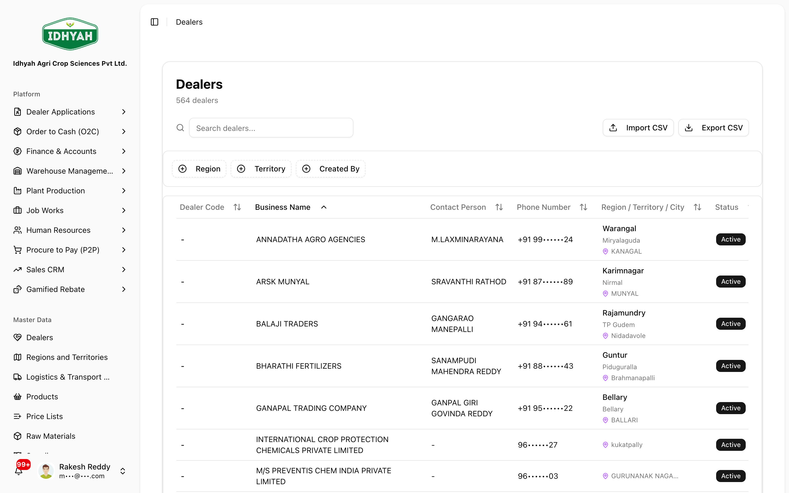
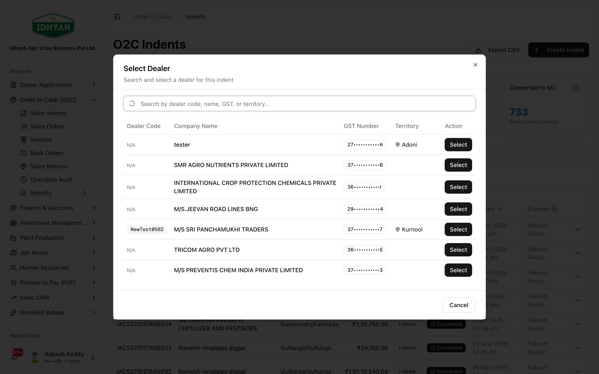
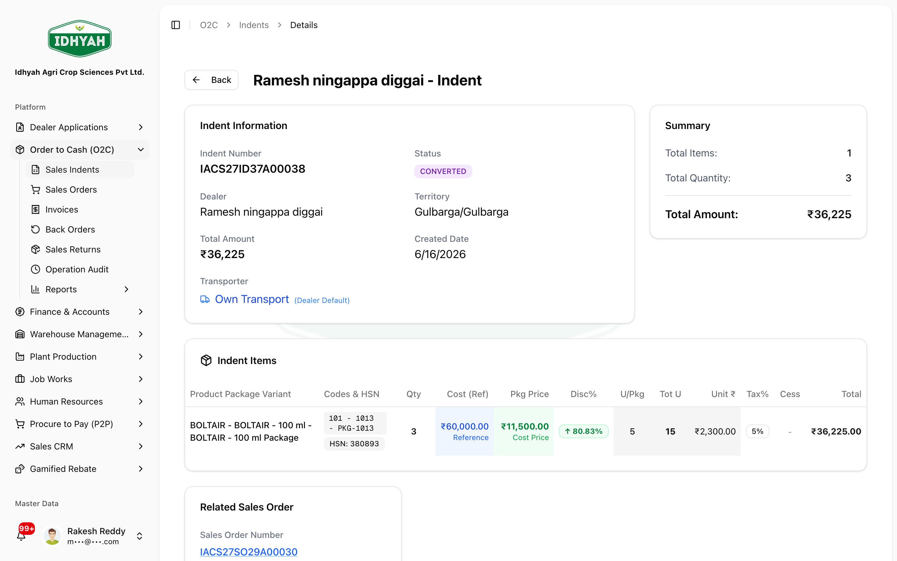
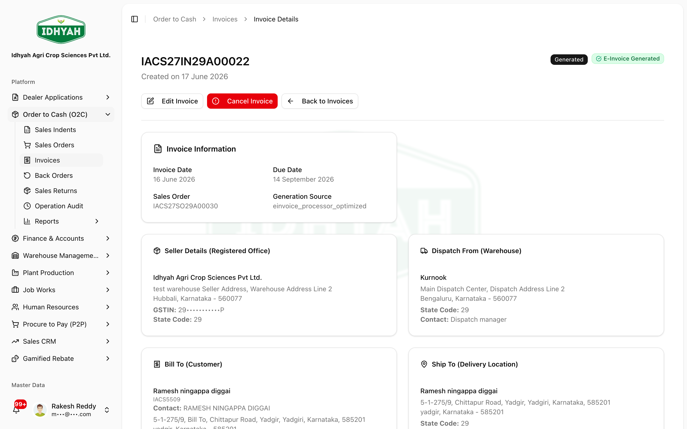
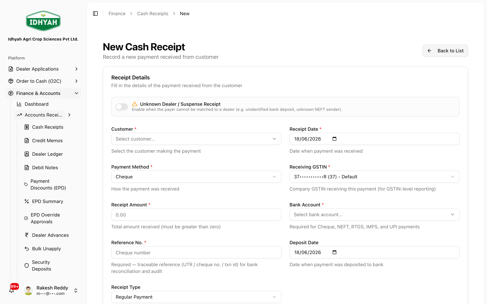

# Use case: Onboard a dealer and fulfil the first order

> **Goal:** Take a brand-new dealer from application all the way to a delivered, invoiced, and paid
> first order — compliantly, on one connected system.
> **Spans:** Dealer Applications → Dealers → Order to Cash → Finance

> **Audience:** Customer + Internal · **Journey:** end-to-end · **Status:** 🟢 Authored
> **Verified:** against the Dealer Applications, Dealers, O2C, and Finance guides on 2026-06-18.

This is the most common "new relationship" journey in DAEE. It stitches together four modules; each
step links to the detailed module guide if you want more depth on a single screen.

## What you'll achieve
By the end, a **new dealer exists** with a credit limit and price list, has **transacted a first
compliant order** (E-Invoice/IRN + E-Way Bill from the real transaction), and the **payment is recorded
against their account** — all visible in the Dealer Ledger and AR Aging, with a full audit trail.

## Who does it

| Role | Leg of the journey |
|---|---|
| **Onboarding / Sales** | Capture the application; review on the dashboard |
| **Approver** | Approve the application and approve the order |
| **Sales** | Raise the first indent for the new dealer |
| **Finance** | Generate the invoice & compliance documents; record the payment |

## Before you begin
- [ ] The **application intake form** and **Terms & Conditions** are configured *(Admin — done once)*.
- [ ] **[Products](../products/README.md)** and **[Price Lists](../price-lists/README.md)** exist for what the dealer will order.
- [ ] At least one **warehouse with stock** (or opening balances) to fulfil from.
- [ ] **[Regions & Territories](../regions/README.md)** are set up so the dealer routes correctly.
- [ ] If the shipment needs an **E-Way Bill**, a **[transport provider](../logistics/README.md)** with a GST Transporter ID is on file.

## The journey at a glance
```
Dealer Applications        Dealers              Order to Cash                         Finance
──────────────────         ───────              ─────────────                         ───────
 1. Capture     ──▶  2. Approve & promote ──▶  3. Raise indent ──▶ 4. Approve &  ──▶  5. Invoice +  ──▶  6. Collect
    application         (creates dealer)           for dealer          fulfil            E-Invoice/IRN        payment
                         + credit limit                              (allocate stock)    + E-Way Bill         (apply to AR)
                         + price list
```

---

## Steps

### 1. Capture the application
**Role:** Onboarding / Sales · **Module:** Dealer Applications
The applicant submits via the custom intake form; you review it on the dashboard.

<!-- capture: { "project": "iacs-md", "route": "/dealer-applications" } -->
→ Detail: [Dealer Applications guide](../dealer-applications/dealer-applications.md).

### 2. Approve & promote to a dealer
**Role:** Approver · **Module:** Dealer Applications → Dealers
Approve the application and **promote** it — this creates the live **Dealer** record with its **credit
limit**, **price list**, and **territory**.

<!-- capture: { "project": "iacs-md", "route": "/dealers" } -->
> **Note** The credit limit and price list you set here drive every downstream order — set them
> deliberately. *(A dealer can also be created by promoting a qualified lead in [Sales CRM](../sales-crm/README.md); this journey uses the application path.)*

### 3. Raise the first indent
**Role:** Sales · **Module:** Order to Cash
**O2C → Sales Indents → Create Indent** for the new dealer; add product lines and submit.

<!-- capture: { "project": "iacs-md", "route": "/o2c/indents", "action": "open-create-dialog" } -->
→ Detail: [O2C Quickstart](../o2c/order-to-cash.md#quickstart-take-your-first-order).

### 4. Approve & fulfil
**Role:** Approver · **Module:** Order to Cash
Approve the indent, then **Process Workflow** to create the Sales Order and allocate stock.

<!-- capture: { "project": "iacs-md", "route": "/o2c/indents", "action": "process-workflow" } -->
> **Caution** A brand-new dealer has no overdue history, so the overdue block won't trigger — but the
> **credit limit** still applies. An order that breaches the limit is held until it's resolved.

### 5. Invoice, E-Invoice & E-Way Bill
**Role:** Finance · **Module:** Order to Cash
Generate the invoice → **E-Invoice (IRN)** → **E-Way Bill** for the shipment. These are produced from
the real transaction, not re-keyed.

<!-- capture: { "project": "iacs-md", "route": "/o2c/invoices", "action": "open-first-invoice" } -->
→ Detail: [Invoice & E-Way Bill guide](../o2c/invoices.md).

### 6. Collect payment
**Role:** Finance · **Module:** Finance (AR)
**Finance → Cash Receipts** → record the dealer's payment and apply it to the invoice.

<!-- capture: { "project": "iacs-md", "route": "/finance/cash-receipts" } -->
→ Detail: [Receipts, credits & discounts](../finance/receipts-credits-discounts.md).

---

## Expected results
- A new **Dealer** record with credit limit, price list, and territory.
- A **Sales Order** fulfilled from allocated stock.
- A **compliant invoice** with a valid **IRN** and **E-Way Bill** tied to the shipment.
- A **cash receipt** applied to the invoice, reflected in the **Dealer Ledger** and **AR Aging**.

## Common mistakes & warnings
> **Caution** Set the **credit limit and price list at promotion (step 2)** — getting these wrong is the
> most common cause of held or mis-priced first orders downstream.
- **No active price list for the dealer** — the indent can't be priced; confirm an approved, in-effect price list targets the dealer/region.
- **Out-of-stock at fulfilment** — step 4 can't allocate; receive stock (or pick an alternate warehouse) first.
- **E-Way Bill without transport details** — if the movement needs one, the transport provider and GST Transporter ID must be on file.
- **Recording a receipt without applying it** — an unapplied receipt leaves the invoice open in AR; always apply it to the invoice.

## Edge cases
- **Lead-sourced dealer** — if the relationship started as a Sales CRM lead, promote the **lead** to a dealer instead of an application; the rest of the journey is identical.
- **Order above the credit limit** — the order is held for review rather than silently allowed.
- **Cancelled / rejected application** — it stays for reporting and does not create a dealer.

## Responsibility map (RACI)

| Step | Onboarding/Sales | Approver | Finance | Admin |
|---|---|---|---|---|
| 1. Capture application | **R/A** | I | — | C |
| 2. Approve & promote | C | **R/A** | I | C |
| 3. Raise indent | **R/A** | I | — | — |
| 4. Approve & fulfil | C | **R/A** | I | — |
| 5. Invoice + compliance | I | I | **R/A** | — |
| 6. Collect payment | I | — | **R/A** | — |

## Troubleshooting
| What you see | Why | Where to fix it |
|---|---|---|
| Indent can't be priced | No approved, in-effect price list for the dealer | [Price Lists](../price-lists/README.md) |
| Order is held | Credit limit breached | Review the dealer's limit / order on the [Dealers](../dealers/README.md) record |
| Stock won't allocate | Insufficient on-hand at the warehouse | [Managing inventory](../warehouse-management/inventory.md) |
| Invoice open after payment | Receipt recorded but not applied | [Receipts, credits & discounts](../finance/receipts-credits-discounts.md) |

## Support and escalation
- **Application / promotion** → Onboarding lead.
- **Pricing / credit** → Sales Manager (pricing) and Finance (credit).
- **Compliance (IRN / E-Way Bill) failures** → Finance + the order's compliance step owner.

## Related guides
[Dealer Applications](../dealer-applications/dealer-applications.md) · [Dealers](../dealers/README.md) ·
[Order to Cash](../o2c/order-to-cash.md) · [Finance & Accounts](../finance/README.md) ·
[Sales CRM](../sales-crm/README.md)

<!-- INTERNAL:START -->
**For the DAEE team (internal):** This journey is the canonical proof of "one connected truth" across
module boundaries. Key hand-offs: (1) **promote** converts an approved application into a `master_dealers`
record carrying credit limit, price list, and territory — the source of every downstream control; (2)
the indent → sales-order → allocation path is the O2C state machine; (3) the invoice produces an **IRN**
and **E-Way Bill** from the posted transaction (generation lives in the O2C / e-invoice path, tracked in
`ewaybill_generation_log` — see [Logistics dev guide](../../developer-guides/logistics.md)); (4) the cash
receipt applies to AR and posts to the ledger. Controls to keep verified at each seam: credit-limit
enforcement, price-list resolution (approved + in-effect + targeting), stock availability at allocation,
and receipt-to-invoice application. Source-of-truth dev guides: [Dealers](../../developer-guides/dealers.md),
[O2C](../../developer-guides/o2c.md), [Price Lists](../../developer-guides/price-lists.md),
[Finance](../../developer-guides/finance.md).
<!-- INTERNAL:END -->
