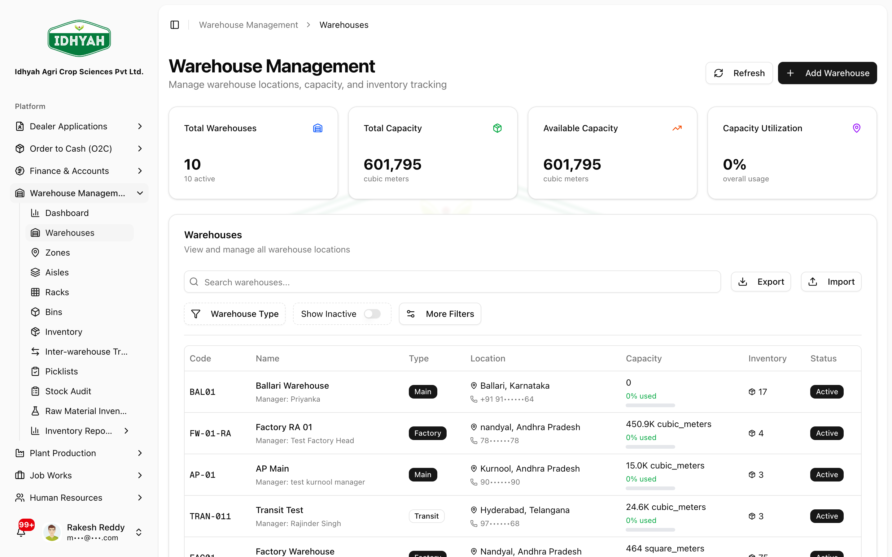
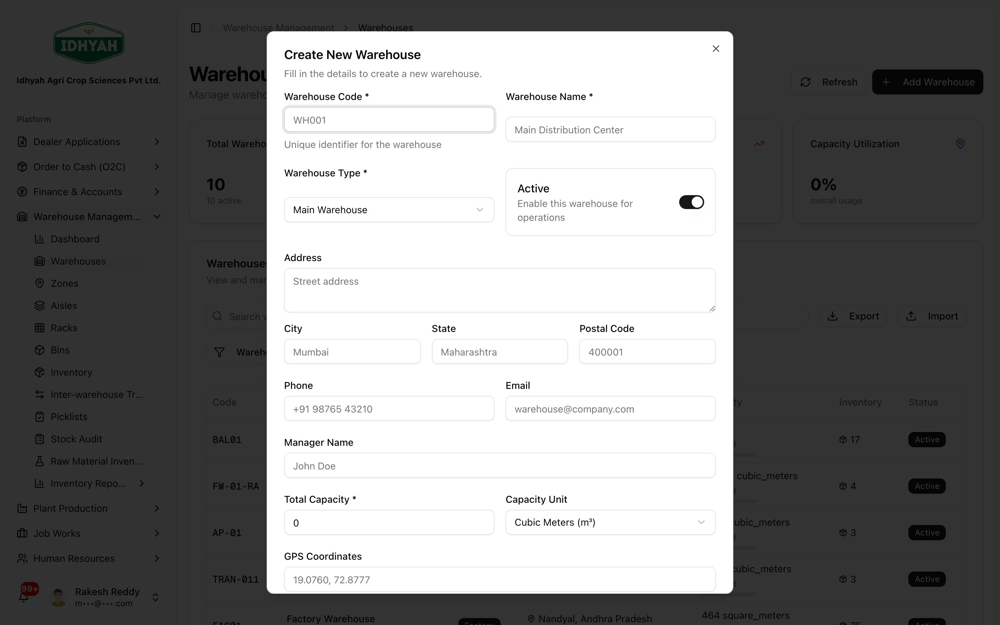
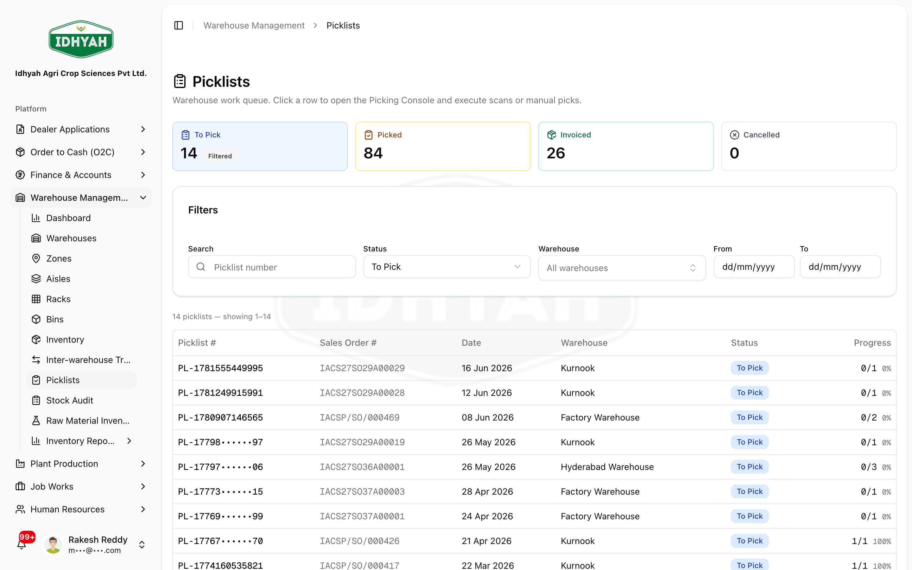
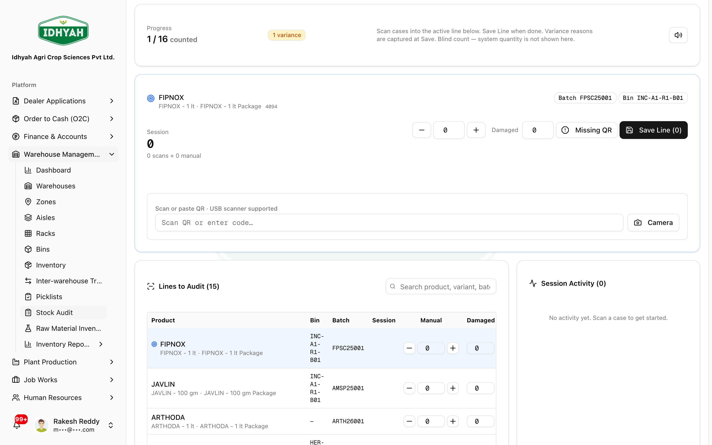
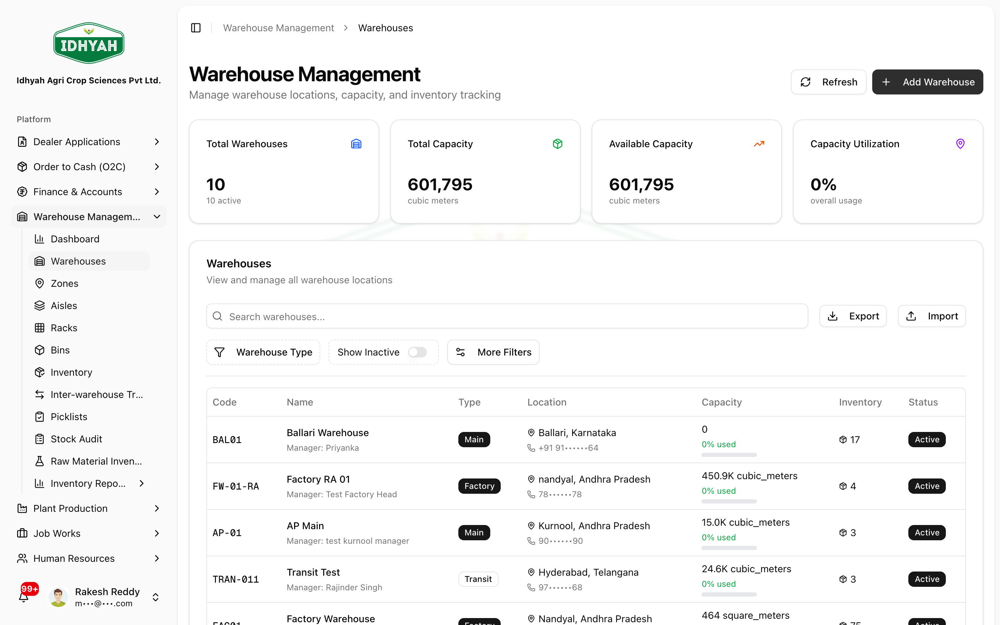
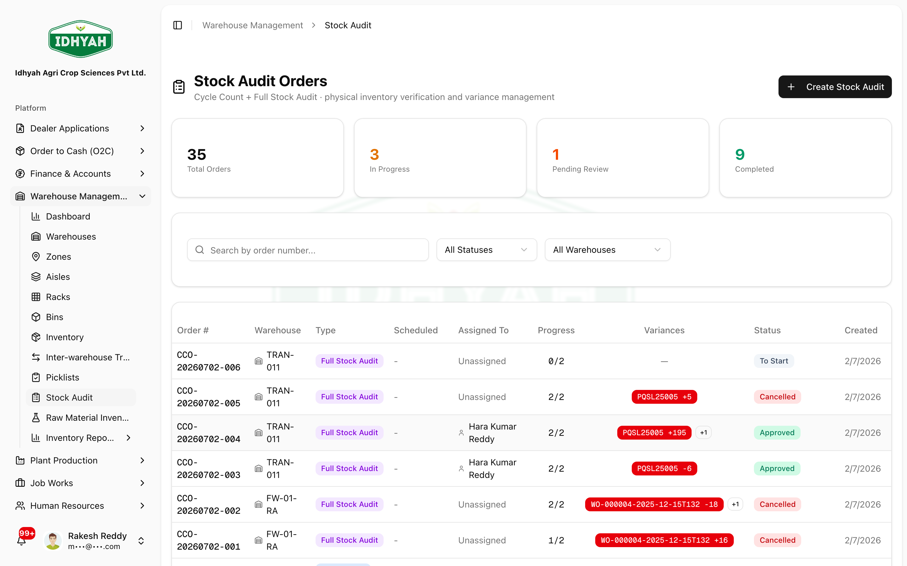

# Warehouse Management

> Set up your storage, track stock by batch and bin, and **pick orders by scanning QR codes** — with
> inter-warehouse transfers and cycle counts.

> **Audience:** Customer + Internal · **Module:** `/warehouse-management` · **Status:** 🟢 Authored
> **Verified:** against `web_app/src/app/warehouse-management` + staging DB on 2026-06-17.

## What you can do
- **Model your storage** — Warehouses → **Zones → Aisles → Racks → Bins**.
- **Track inventory** — stock by **product batch** and **bin**, with allocations and movement history (**FEFO** — first-expiry-first-out).
- **Scan QR at every step** — a **scan-first** workflow (USB barcode gun **or** device camera) for **picking**, **inter-warehouse transfer load & receive**, and **cycle counts**; every scan is recorded to an audit ledger.
- **Move stock between warehouses** — **Inter-Warehouse Transfers (IWT)** with **scan-to-load** and **scan-to-receive**.
- **Verify stock** — **Cycle Counts** with **scan-to-count**, variance approval, and adjustment.
- **Manage raw materials** — dedicated raw-material inventory.
- **Report** — stock movement, batch tracking, inventory health/ledger, transfers.

## Before you begin

### What you need
- At least one **warehouse**, with its **zones / aisles / racks / bins** defined.
- **Products** (and their **batches**) in stock.
- A device with a **camera** for QR scanning (phone, tablet, or laptop) — a **manual entry** fallback is always available.
- Sales Orders allocated for picking (picklists are generated from O2C — see [Order to Cash](../o2c/order-to-cash.md)).

### Roles and what each can do

| Role | Typical responsibilities |
|---|---|
| **Warehouse Admin** | Set up warehouses, zones, aisles, racks, bins |
| **Picker / Stores** | Run the scan-first picking console; record receipts |
| **Warehouse Supervisor** | Start/reopen picklists, approve cycle-count variances, ship/receive transfers |
| **Inventory Controller** | Monitor stock, batches, and inventory reports |

<!-- INTERNAL:START -->
Permissions: `warehouses:read`, `picklists:read|create|start|update|finalize|reopen`, `cycle_count_orders:read|create|update`, `inventory:read`, `back_order_management:*`. Tenant-isolated via RLS. Picking is scan-first (`PickingConsole` + `QRCodeScanner` using `@zxing/library`); QR-to-batch matching is variant/FEFO-aware (`lib/batchMatch`). *(Tables, finalize concurrency model, edge functions → [Warehouse Developer Guide](../../developer-guides/warehouse-management.md).)*
<!-- INTERNAL:END -->

### How storage is organised
```
Warehouse ─▶ Zone ─▶ Aisle ─▶ Rack ─▶ Bin   ← stock lives in bins, tracked by product batch
```
Picking is **scan-first**: a picklist (from a Sales Order) lists what to pick; you **scan each item/batch
QR** to confirm and pick it.

---

## Set up a warehouse
**Role:** Warehouse Admin · **Result:** a warehouse ready to hold and move stock

1. On **Warehouse Management → Warehouses**, click **Add Warehouse**.
   
   <!-- capture: { "project": "iacs-md", "route": "/warehouse-management/warehouses" } -->
2. In the **Add Warehouse** dialog enter the **name**, **code**, **type** (Main / Factory / Transit), and
   **address**, then save.
   
   <!-- capture: { "project": "iacs-md", "route": "/warehouse-management/warehouses", "action": "open-create-dialog" } -->
3. Build the **storage hierarchy** so stock has a home: create **Zones**, then **Aisles**, **Racks**, and
   **Bins** (Warehouse Management → Zones / Aisles / Racks / Bins). Stock is tracked **by batch in a bin**.
4. **Link the warehouse to the Address Book for billing** (below) so its GSTIN and seller/dispatch
   details print correctly on invoices and E-Way Bills.

### Link a warehouse to the Address Book (billing)
This is a **two-part** step — create the warehouse's addresses in the Address Book, then link them on the
warehouse:

1. **Create the addresses in the [Address Book](../address-book.md)** — add a **warehouse** entity address
   for the **Seller (Registered Office)** and one for the **Dispatch (Shipping Location)**, each with its
   **GSTIN**.
   
2. **Link them on the warehouse** — open the warehouse's **Edit** dialog and, under **E-Invoice Address
   Configuration**, pick the **Seller** and **Dispatch** addresses you just created. They become the
   **Ship-From / seller place of business** on O2C invoices, delivery challans, and E-Way Bills — and on
   [Inter-Warehouse Transfers](./iwt.md).

> **Caution** A warehouse with no **Dispatch/Seller address or GSTIN** will fail or misprint E-Invoices
> and E-Way Bills. Set these before the warehouse starts shipping.

---

## Managing stock levels

### How stock enters a warehouse
Stock is **never hand-typed** — it enters through the operational documents, so every change has an
audit trail:
- **Goods Receipt (GRN)** — receiving a purchase order ([P2P](../p2p/procure-to-pay.md)).
- **Plant Production** — finished goods from a production order ([Plant Production](../plant-production/README.md)).
- **Inter-Warehouse Transfer** — stock received from another warehouse ([IWT](./iwt.md)).
- **Opening balances** — migrated stock at go-live (data import), plus **QR backfill** for existing/legacy
  inventory (see [QR Labels & Batch Traceability](../plant-production/qr-and-batch-traceability.md)).

### How to adjust / correct stock (Stock Audit)
There is **no direct "edit quantity"** — corrections go through **Stock Audit**, so variances are reviewed
and approved (control + audit). The **Stock Audit** menu covers both a targeted **Cycle Count** and a
**Full Stock Audit (FSA)**:
1. **Warehouse Management → Stock Audit → Create** a count order for a location/products (cycle count) or
   the whole warehouse (full stock audit).
2. **Scan to count** each bin; DAEE computes the **variance** (counted vs system).
3. A supervisor **reviews and approves** the variance → the **adjustment** posts and stock is corrected.

> **Stock audit = Stock Audit menu.** Physical-vs-book verification is done here (scan-to-count, variance
> review, approved adjustment) — run a **Cycle Count** for a location or a **Full Stock Audit** for the
> whole warehouse. **Full step-by-step (create → count → variance → approve → adjust):
> [Stock Audit — Counting & Adjustment](./stock-audit.md).**

To trace movements, use the **Inventory Ledger**, **Stock Movement**, and **Inventory Health** reports
(under Inventory → Reports).

---

## Quickstart: pick an order by scanning
**You'll:** open a picklist and pick it by scanning QR codes · **Role:** Picker

1. Go to **Warehouse Management → Picking** and open a picklist (created when a Sales Order is allocated).
   
   <!-- capture: { "project": "iacs-md", "route": "/warehouse-management/picking" } -->
2. **Start Picking.** For each line, point the camera at the item's **batch QR** (prompt: *"Scan a batch QR"*). A correct scan matches the line and marks it **Picked**. Can't scan? Use the **Manual** tab to type the code.
3. If the exact batch isn't available, choose **Substitute** and pick a reason (batch damaged, not found, quality rejected, quantity shortage, access bypass, or other).
4. When every line is picked, click **Complete Picklist**. (Completion is safe to retry; a supervisor can **Reopen** it within a short window if a correction is needed.)

**Next steps:** the order proceeds to invoicing in [O2C](../o2c/sales-orders.md).

---

## Scan-verified operations
Beyond picking, DAEE is **scan-first** at the points where stock physically moves or is counted. Each
scanner accepts a **USB barcode gun** or the **device camera**; a wrong-line or duplicate scan is
**rejected** (it doesn't change the count), and every scan is written to an audit trail.

### Scan to load (dispatch a transfer)
**Where:** Inter-Warehouse Transfer detail, status **Approved** → **Scan & Load**.
Scan each case as it's loaded; the dialog tracks **shipped vs. requested** per line.

<!-- capture: { "project": "iacs-md", "route": "/warehouse-management/iwt/658c71a4-beb1-48a1-b63f-bf33268e7d09", "action": "click-scan-load" } -->

### Scan to receive (goods receipt at destination)
**Where:** the **shipped** transfer at the destination → **Scan & Receive**.
Scan each case off the truck; the system **enforces received ≤ shipped** and flags any mismatch.

<!-- capture: { "project": "iacs-md", "route": "/warehouse-management/iwt/5946c0f1-cde4-4178-9861-5d1118b8452b", "action": "click-scan-receive" } -->

### Scan to count (cycle count)
**Where:** a cycle count **in progress** → **Scan** on a count line.
Each valid scan that matches the line's batch **increments the verified count**; the dialog shows
**expected vs. scanned**, duplicates blocked, and rejected scans.

<!-- capture: { "project": "iacs-md", "route": "/warehouse-management/cycle-count/4880763c-e44c-4305-8643-219fc3b98613", "action": "click-scan-count" } -->

> **Tip** Warehouse **scans** QR labels; the labels are **generated in Plant Production** at packaging
> (so that guide's screenshots are Plant Production screens). Full QR detail — what the code encodes,
> generation, and traceability — is in
> [QR Labels & Batch Traceability](../plant-production/qr-and-batch-traceability.md).

---

## Pages & buttons

### Warehouses & storage (`/warehouse-management/warehouses`, `/zones`, `/aisles`, `/racks`, `/bins`)

<!-- capture: { "project": "iacs-md", "route": "/warehouse-management/warehouses" } -->

| Button | What it does |
|---|---|
| **Create** (per level) | Add a warehouse, zone, aisle, rack, or bin. |
| **(open a warehouse)** | View its layout, stock, and a mobile warehouse interface. |

### Picking (`/warehouse-management/picking`)
| Button | What it does |
|---|---|
| **(open a picklist)** | Enter the scan-first picking console. |
| **Start Picking** | Begin the pick (records who and when). |
| **Scan a batch QR** | Camera scan; matches the item/batch to the picklist line and marks it **Picked**. |
| **Manual** | Type the code if the camera can't be used. |
| **Substitute** | Pick a different batch with a mandatory reason. |
| **Complete Picklist** | Finalize the pick (idempotent / safe to retry). |
| **Reopen** | Supervisor re-opens a finalized picklist within the allowed window. |

### Inter-Warehouse Transfers (`/warehouse-management/iwt`)

<!-- capture: { "project": "iacs-md", "route": "/warehouse-management/iwt" } -->

| Button | What it does |
|---|---|
| **Create Transfer** | Move stock from one warehouse to another. |
| **Scan & Load** | At dispatch (approved transfer), **scan each case's QR** as it's loaded; tracks shipped-vs-requested. |
| **Ship** | Dispatch the transfer (with shipping documents). |
| **Scan to Receive (GRN)** | At the destination, **scan each case off the truck**; the system enforces *received ≤ shipped*. |
| **Receive** | Record receipt at the destination (creates a goods receipt). |

> **Tip** Both ends of an IWT are **scan-verified**: scan-to-load on dispatch and scan-to-receive at the destination. A wrong or duplicate scan is rejected, so the counts reflect what was physically handled.

### Cycle Count (`/warehouse-management/cycle-count`)

<!-- capture: { "project": "iacs-md", "route": "/warehouse-management/cycle-count" } -->

| Button | What it does |
|---|---|
| **Create Cycle Count Order** | Start a count for a location/products. |
| **Scan** (per line) | Open the **scan-to-count** dialog — each valid scan that matches the line's batch increments the verified count (wrong-line/duplicate scans are rejected). |
| **Record / Recount** | Enter counted quantities manually (recount on discrepancy). |
| **Approve Variance Adjustment** | Approve the stock adjustment for a variance (with a reason). |

### Inventory & Raw Materials (`/o2c/inventory`, `/raw-material-inventory`)

<!-- capture: { "project": "iacs-md", "route": "/o2c/inventory" } -->

| Button | What it does |
|---|---|
| **Filters / Search** | View on-hand stock by batch, bin, and warehouse (FEFO ordering). |

---

## Common use cases
- **Pick and dispatch a sales order by scanning** — the everyday flow: open picklist → scan → complete.
- **Substitute a batch** — when the FEFO-suggested batch is damaged/unavailable, substitute with a recorded reason.
- **Rebalance stock** — Inter-Warehouse Transfer from a surplus to a deficit warehouse.
- **Verify and correct stock** — schedule a cycle count, recount discrepancies, approve the adjustment.

## Reference
- **Storage hierarchy:** Warehouse → Zone → Aisle → Rack → Bin.
- **Picklist statuses:** Allocated → Picking in progress → Picked → Packed (or Partial / Cancelled).
- **Substitution reasons:** original batch damaged, not found, quality rejected, quantity shortage, access bypass, other.
<!-- INTERNAL:START -->Status codes — picklists: `pending, allocated, picking_in_progress, picked, packed, partial, cancelled`. Substitution codes: `original_batch_damaged, original_batch_not_found, quality_rejected, quantity_shortage, fefo_bypass_physical_access, other`. Tables: `warehouses, warehouse_zones, warehouse_aisles, warehouse_racks, warehouse_bins, warehouse_stock, inventory, inventory_allocations, inventory_transactions, product_batches (FEFO view vw_product_batches_fefo), picklists, picklist_items, picklist_item_picks, picklist_substitutions, cycle_count_orders(+_items), iwt_shipping_documents`. Schema → [Developer Guide](../../developer-guides/warehouse-management.md).<!-- INTERNAL:END -->
- **Reports (Inventory Reports):** Stock Movement, Batch Tracking, Inventory Health, Inventory Ledger, Inter-Warehouse Transfer, Warehouse Stock.

## Troubleshooting
| What you see | Why it happens | How to fix it |
|---|---|---|
| The camera won't start | Browser camera permission denied, or no camera | Allow camera access for the site; or use the **Manual** tab to type the code |
| A scan is rejected | The scanned batch doesn't match the picklist line (wrong product/variant/batch) | Scan the correct batch, or **Substitute** with a reason if the right batch is unavailable |
| Can't complete the picklist | Not all lines are picked | Pick or substitute the remaining lines, then **Complete Picklist** |
| Need to fix a completed pick | Picklist already finalized | Ask a supervisor to **Reopen** it within the allowed window |
| Cycle-count variance won't post | Adjustment not approved | A supervisor must **Approve Variance Adjustment** (with a reason) |

## Support and escalation
- **Scanning / device issues** → your Warehouse Supervisor or IT.
- **Stock discrepancies / adjustments** → Inventory Controller (cycle count + approval).
- **Picklist reopen / correction** → Warehouse Supervisor.

## Related workflows
[Order to Cash (O2C)](../o2c/order-to-cash.md) (picklists originate from sales orders) · [Procure to Pay (P2P)](../p2p/procure-to-pay.md) (goods receipts add stock).
