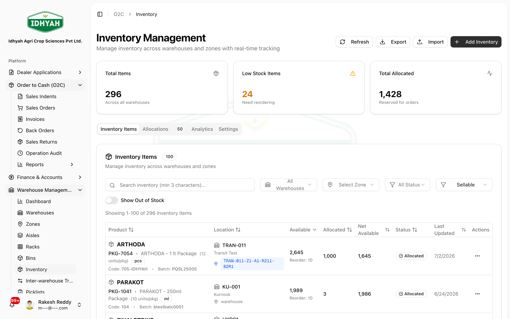
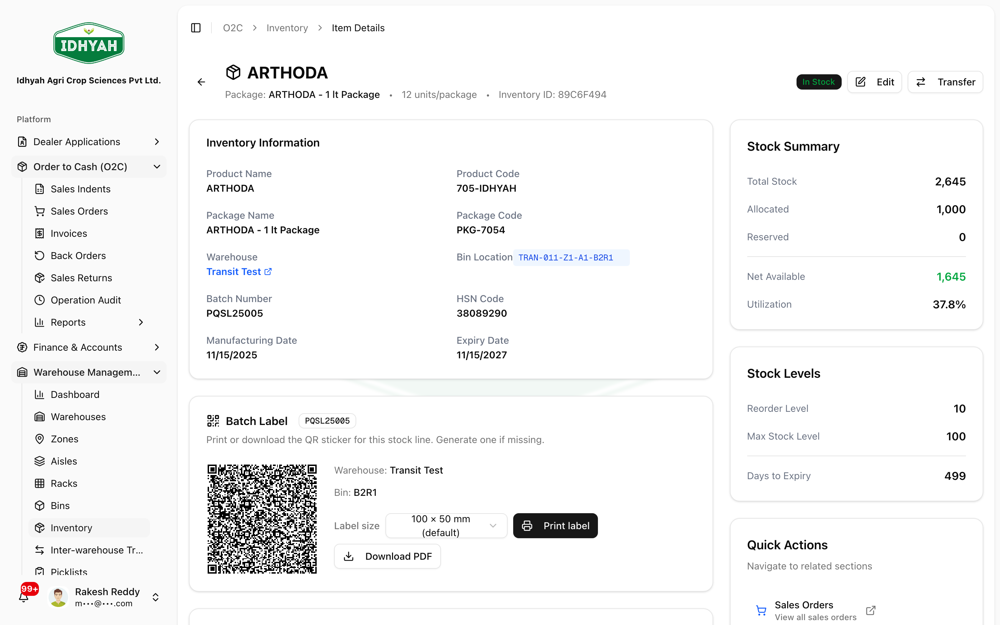
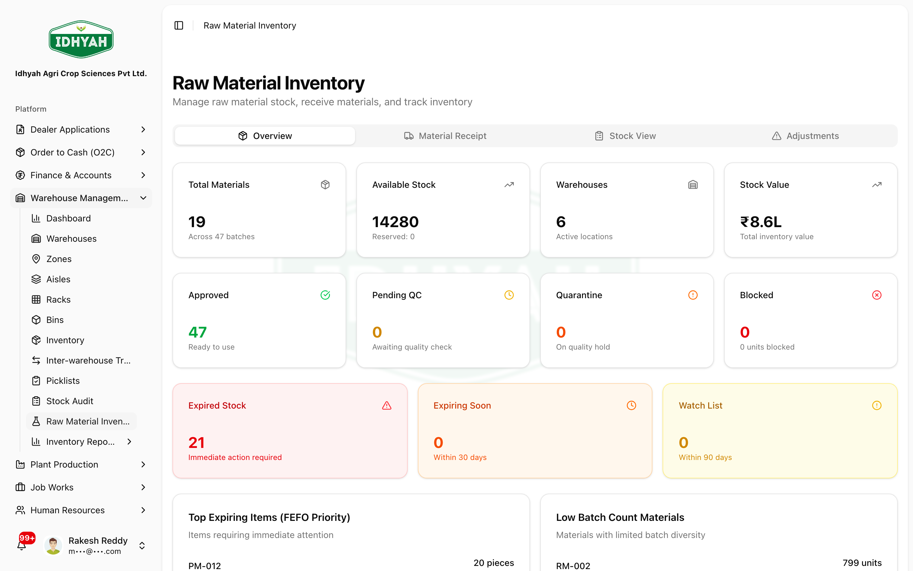

# Managing Inventory — in detail

> See exactly **what stock you hold, in which batch, in which bin, and when it expires** — for both
> finished goods and raw materials.

> **Audience:** Customer + Internal · **Module:** `/o2c/inventory`, `/raw-material-inventory` · **Status:** 🟢 Authored
> **Verified:** against `web_app/src/app/o2c/inventory` + `raw-material-inventory` on 2026-06-18.

For the full module, see the **[Warehouse Management guide](./README.md)**.

## What this is for
The inventory views give you a live picture of on-hand stock:
- **Inventory** (**Warehouse Management → Inventory**) — finished goods available to sell, by **batch**, **bin**, and **warehouse**, ordered **earliest-expiry-first (FEFO)**.
- **Raw Material Inventory** (**Warehouse Management → Raw Material Inventory**) — the materials available to issue into production, and where you **receive** materials into stock.

Stock figures here are **driven by your operations** — they go up when you receive goods (purchases,
production, transfers in) and down when you pick/ship, issue to production, or transfer out. You don't
edit stock numbers directly; you correct them through a **[cycle count](./README.md#scan-verified-operations)**.

## When to use it
- Checking availability before promising stock to a dealer.
- Finding which **bin** holds a batch, or which batches are **near expiry**.
- Confirming raw-material availability before a production run.

## Prerequisites
- Warehouses and bins set up.
- Products / raw materials defined; stock received.

## Who does this
| Role | What they do |
|---|---|
| **Inventory Controller** | Monitors stock, batches, and expiry |
| **Sales / Planning** | Checks availability before committing orders |
| **Production / Stores** | Checks raw-material availability |

## Step-by-step

### 1. View finished-goods inventory
Go to **Warehouse Management → Inventory** (the page opens at `/o2c/inventory`). Use search and filters
to find a product; each row shows the **batch**, **bin**, **warehouse**, available quantity, and **expiry**.

<!-- capture: { "project": "iacs-md", "route": "/o2c/inventory" } -->

### 2. Open a batch and print its QR label
Open an inventory row to see the **batch detail**. In the **Batch Label** panel, choose a **Label size**
(e.g. 100 × 50 mm) and click **Print label** (or **Download PDF**) — this is the same QR that picking,
transfers, and stock audit scan. If a stock line has no label yet, use **Generate one if missing** first
(handy for manually-created or legacy batches).

<!-- capture: { "project": "iacs-md", "route": "/o2c/inventory", "action": "open-first-product" } -->
> **Tip** For everything the QR encodes and full batch traceability, see
> [QR Labels & Batch Traceability](../plant-production/qr-and-batch-traceability.md).

### 3. Receive raw materials into inventory
This is how raw materials **enter** stock (before they can be issued to production). Go to
**Warehouse Management → Raw Material Inventory** and click **Receive Material**:
1. Pick the **material**, the **warehouse → zone → bin** it lands in, and the **quantity**.
2. Record the **batch / lot** and, where relevant, **expiry** and a supplier/GRN reference.
3. Confirm — the material is added to raw-material inventory at that bin, ready to issue.

<!-- capture: { "project": "iacs-md", "route": "/raw-material-inventory" } -->
> **Note** Finished goods enter inventory differently — from **plant production** (a completed
> production/packaging run) or a **GRN**, not from this screen. See
> [How stock enters a warehouse](./README.md#how-stock-enters-a-warehouse).

### 4. Read it FEFO-first
Stock is presented **earliest-expiry-first**, so the batch you should move/use first is at the top.
This is also the batch picking will suggest.

## Expected result
- A reliable, real-time view of stock by batch/bin/warehouse and expiry.
- Confidence to allocate stock, pick, or plan production against accurate figures.

## Common mistakes & warnings
> **Caution** Inventory is a **read view** of what your operations produced. To correct a figure, run a cycle count and approve the variance — never improvise an adjustment.
- **Ignoring expiry** — always move the **earliest-expiry** batch first; near-expiry stock is surfaced for a reason.
- **"Stock looks wrong"** — usually a missing receipt or an un-applied movement; reconcile via cycle count rather than assuming the view is broken.
- **Allocated ≠ available** — stock reserved for open orders isn't free to promise elsewhere.

## Related workflows
[Warehouse Management](./README.md) · [Inter-Warehouse Transfer](./iwt.md) · [Picking](./README.md#quickstart-pick-an-order-by-scanning) · [QR Labels & Batch Traceability](../plant-production/qr-and-batch-traceability.md)

## Support and escalation
Stock accuracy / discrepancies → **Inventory Controller**. Availability for orders → **Sales / Planning**.
