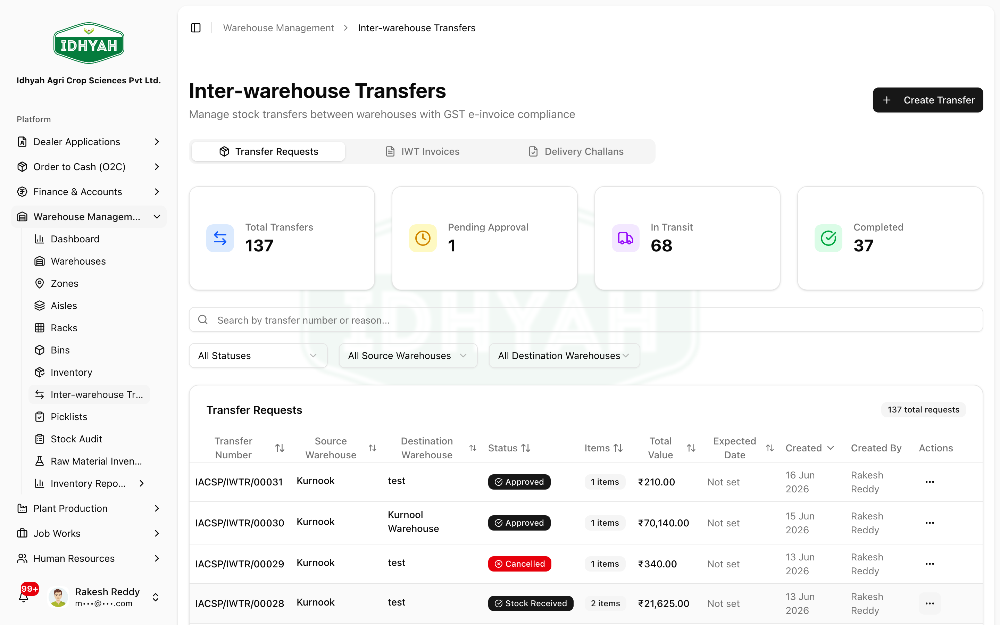
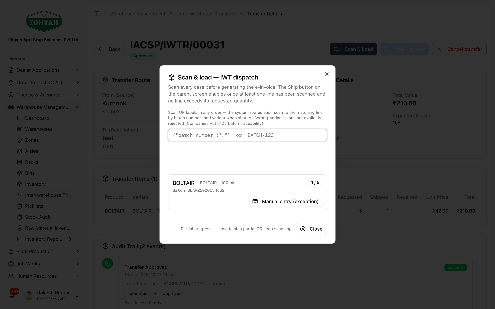
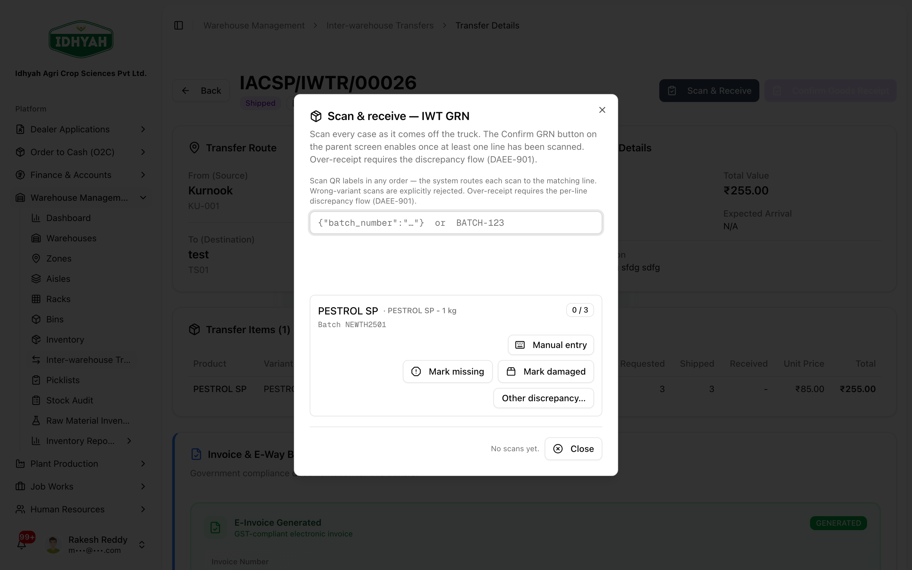

# Inter-Warehouse Transfer (IWT) — in detail

> Move stock from one warehouse to another with **scan verification at both ends** — so what leaves
> the source matches what arrives at the destination.

> **Audience:** Customer + Internal · **Module:** `/warehouse-management/iwt` · **Status:** 🟢 Authored
> **Verified:** against `web_app/src/app/warehouse-management/iwt` on 2026-06-18.

For the full module, see the **[Warehouse Management guide](./README.md)**.

## What this is for
An **Inter-Warehouse Transfer (IWT)** relocates stock between your warehouses (e.g. balancing stock to
a depot closer to demand). DAEE tracks the transfer end-to-end: you **scan each case as it's loaded**
for dispatch, and the receiving warehouse **scans each case off the truck** — the system won't let the
received quantity exceed what was shipped.

## When to use it
- Rebalancing stock from a surplus warehouse to one that's short.
- Moving stock to a depot nearer a dealer for faster fulfilment.

## Prerequisites
- Two warehouses set up, with stock available at the **source**.
- QR-labelled batches and a **scanner or camera** at both ends.
- Transport details if an **E-Way Bill** is required for the movement.

## Who does this
| Role | What they do |
|---|---|
| **Warehouse Supervisor** | Creates and approves the transfer |
| **Picker / Stores (source)** | Scans & loads the cases for dispatch |
| **Stores (destination)** | Scans & receives the cases |

## Step-by-step

### 1. Create the transfer
Go to **Warehouse Management → Inter-warehouse Transfers** → **Create Transfer**. Choose source and
destination warehouses and add the items and quantities, then submit for approval.

### 2. Approve it
Once approved, the transfer is ready to load.

### 3. Scan & Load at the source
On the approved transfer, choose **Scan & Load**. Scan each case as it's loaded — the dialog shows
**shipped vs. requested** per line so you can see what's still to load. Then **Ship** the transfer.

### 4. Scan & Receive at the destination
When the goods arrive, open the shipped transfer at the destination and choose **Scan & Receive**.
Scan each case off the truck. DAEE **enforces received ≤ shipped** and flags any shortfall as a
discrepancy.

### 5. Complete / resolve
- If received matches shipped → the transfer completes and stock lands at the destination.
- If there's a shortfall → it's flagged as a **discrepancy** for review before closing.

## Pricing, invoice & E-Way Bill

An IWT is an **internal stock movement, not a sale** — so the documents are valued and generated
differently from an O2C order.

### How the transfer is priced
- Each line is valued at the **stock (batch) unit cost** of the goods being moved — the inventory
  valuation of the batch — **not** a customer price list. There is no margin or discount, because
  nothing is being sold; the value simply follows the goods so both warehouses' books stay consistent.
- The **Scan & Load / Ship** dialog shows this per-line value and the line total, so you can confirm the
  consignment value before you ship.

### What gets generated at Ship
| Document | When it's generated | Notes |
|---|---|---|
| **E-Invoice (IRN)** | **Always, at Ship** — the system treats it as **mandatory** for an inter-warehouse transfer | It is a self-invoice raised between the two warehouses' GST registrations for the deemed supply; you can't complete the ship step without it. |
| **Delivery Challan (DC)** | With the movement | Accompanies the goods; the DC PDF has the **E-Way Bill embedded** when one is generated. |
| **E-Way Bill (EWB)** | **Optional — you opt in at Ship** via *"Generate E-Way Bill with E-Invoice"* | Generated together with the E-Invoice when selected. |

### E-Way Bill control logic
- The E-Way Bill is **operator-initiated** at Ship (a checkbox), not auto-generated. Turn it on when the
  movement needs one — apply the statutory **₹50,000 consignment-value** rule for goods in transit.
- **Vehicle number entered** → the E-Way Bill is generated with **Part A + Part B** (complete).
- **No vehicle number** → **Part A only**; assign the vehicle and **update Part B** later when the truck
  is allotted.

> **Caution** The E-Invoice for an IWT is raised at Ship and cannot be skipped. Confirm the source and
> destination warehouse **GSTINs and addresses** are correct *before* shipping — a wrong GSTIN on the
> self-invoice is an e-invoice correction, not a quick edit. (See [Address Book](../address-book.md).)

<!-- INTERNAL:START -->
Edge fn `interwarehouse-transfer` builds the E-Invoice + (optional) E-Way Bill via the shared GSTZen
helpers (`buildEWayBillPayload` / `callGSTZenEWayBillAPI` in `_shared/gstzen-eway-bill.ts`) when
`generate_eway_bill` is set. Line valuation precedence: `item.unit_price || item.unit_cost ||
inventoryRecord.unit_price`. E-Invoice is enforced client-side in `ShipIWTDialog` ("E-Invoice generation
is mandatory for inter-warehouse transfers"); `delivery_challans.eway_bill_pdf_file_id` holds the
embedded EWB PDF. **Known nuance (verify per tenant):** the current flow enforces an E-Invoice on every
IWT ship; a same-GSTIN transfer strictly needs only a delivery challan under GST. Flag to Finance if a
tenant transfers between warehouses sharing one GSTIN.
<!-- INTERNAL:END -->

## Expected result
- Stock decremented at the source and added at the destination, **bin-accurate**.
- A scan-verified trail for both dispatch and receipt; an E-Way Bill where the movement requires one.

## Common mistakes & warnings
> **Caution** The transfer is only as trustworthy as the scans. Scan every case at load **and** at receipt — don't short-cut with manual counts.
- **Receiving more than shipped** — the system blocks this by design; if cases are genuinely extra, investigate before forcing it.
- **Shipping without an E-Way Bill** — if the movement needs one, add transport details first.
- **Disabling a source bin mid-transfer** — finish the transfer before reorganising those locations.

## Related workflows
[Warehouse Management](./README.md) · [Managing Inventory](./inventory.md) · [QR Labels & Batch Traceability](../plant-production/qr-and-batch-traceability.md) · [Order to Cash (O2C)](../o2c/order-to-cash.md)

## Support and escalation
Transfer approvals → **Warehouse Supervisor**. Discrepancies / shortfalls → **Inventory Controller**.
