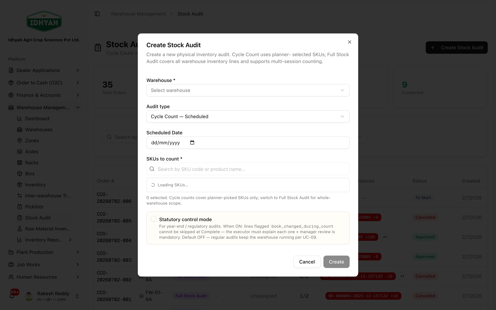
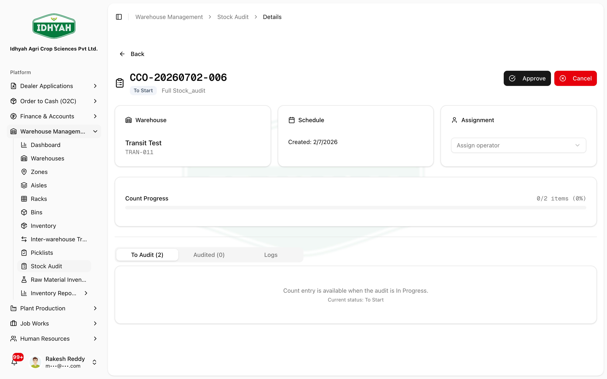

# Stock Audit (Counting & Adjustment) — in detail

> Verify **physical stock against the system** and correct any difference — the **only** approved way to
> change a stock figure. A **Cycle Count** checks a slice (a location / some products); a **Full Stock
> Audit (FSA)** checks the whole warehouse. Every count is **scanned**, and every variance is **reviewed
> and approved** before the adjustment posts.

> **Audience:** Customer + Internal · **Module:** `/warehouse-management/cycle-count` (menu: **Stock Audit**) · **Status:** 🟢 Authored
> **Verified:** against `web_app/src/app/warehouse-management/cycle-count` on 2026-07-03.

For the module overview see the **[Warehouse Management guide](./README.md)**.

## What this is for
Inventory figures are **operationally driven** — you never hand-edit a quantity. When physical stock and
the system disagree (miscount at receipt, damage, shrinkage), you reconcile it through **Stock Audit**:
- **Cycle Count** — a **targeted** count of a location or selected products, run regularly.
- **Full Stock Audit (FSA)** — a **wall-to-wall** count of the entire warehouse (e.g. year-end).

Both follow the same **count → variance → approve → adjust** path, so every correction is scan-verified
and has an audit trail.

## Who does this
| Role | What they do |
|---|---|
| **Stores / Counter** | Scans and counts stock on the count order |
| **Inventory Controller / Supervisor** | Creates the order, reviews variances, and **approves** adjustments |

## The lifecycle
```
Draft → In progress (counting) → Pending approval (variances) → Approved → Adjusted / Completed
```

## Step-by-step

### 1. Create a count order
**Warehouse Management → Stock Audit → Create Stock Audit.** Choose the **warehouse** and the **Audit
type** — **Cycle Count** (search and pick the **SKUs to count**) or **Full Stock Audit** (all warehouse
lines) — and a **scheduled date**.

<!-- capture: { "project": "iacs-md", "route": "/warehouse-management/cycle-count" } -->


<!-- capture: { "project": "iacs-md", "route": "/warehouse-management/cycle-count", "action": "open-create-dialog" } -->

> **Statutory control mode** — turn this **on** for year-end / regulatory audits: lines whose book stock
> changed mid-count **can't be skipped** at Complete (the executor must explain each), and **manager
> review is mandatory**. Leave it off for routine cycle counts.

### 2. Count by scanning (blind count)
Open the order (**Assign** an operator first) and count each line by **scanning the batch QR** (USB
scanner or camera) and clicking **Save Line**. Counting is a **blind count** — the **system quantity is
not shown** to the counter, so the count is unbiased; the **variance** is computed at Save.

- **Can't scan a label?** Mark **Missing QR** for that line instead of skipping it.
- **Damaged cases?** Record them in the **Damaged** field so they're counted and reconciled.

### 3. Review variances and approve
When counting is done, the order's **Audited** tab lists each line's **variance** (counted vs system).
The Supervisor reviews and:
- **Approve** — accept the count; DAEE posts the **adjustment** and stock is corrected to the counted figure.
- **Request recount** — send a line back to be counted again before deciding.
- **Reject** — decline the variance (no adjustment for that line).

<!-- capture: { "project": "iacs-md", "route": "/warehouse-management/cycle-count", "action": "open-first-invoice" } -->

> **Only an approved variance changes stock.** The adjustment posts on approval — with the who/when/how-much
> recorded — so the correction is auditable.

## Expected result
- Physical and system stock **reconciled**, with a scan-verified count and an approved adjustment behind
  every change.
- A **Stock Audit log** of the order — counts, variances, decisions, and exceptions — for the auditor.

## Common mistakes & warnings
> **Caution** Never "fix" stock by editing a quantity elsewhere — it bypasses the count + approval control
> and breaks the audit trail. Corrections go **only** through an approved Stock Audit variance.
- **Skipping a line you couldn't scan** — record a **Missing-QR exception** instead, so the line is accounted for.
- **Approving without recounting a large variance** — a big gap usually means a miscount; use **Request recount** first.
- **Leaving an order in Pending approval** — variances don't post until approved; stock stays wrong until you close it out.

<!-- INTERNAL:START -->
Actions (`cycle-count/actions`): `createCycleCountOrder` (`AUDIT_TYPE` = cycle vs full stock audit),
`captureLineBaseline` (system-qty snapshot), `recordCount`, `approveVariance` / `rejectVariance` /
`requestRecount`, `recordSurplusLine`, `recordMissingQRException`, `submitCompleteCountReasons`. Statuses:
draft → in_progress → pending_approval → approved → Adjusted/Completed. Adjustment posts on
`approveVariance`. Logs via `getCycleCountLogs`. Perms `cycle_count_orders:read|create|update`. Menu label
is **Stock Audit** (DAEE-886) covering both Cycle Count and FSA at `/warehouse-management/cycle-count`.
<!-- INTERNAL:END -->

## Related workflows
[Warehouse Management](./README.md) · [Managing Inventory](./inventory.md) · [Inter-Warehouse Transfer](./iwt.md) · [QR Labels & Batch Traceability](../plant-production/qr-and-batch-traceability.md)

## Support and escalation
Count discrepancies / approvals → **Inventory Controller**. Repeated large variances at one location →
investigate process (receipt accuracy, bin hygiene) with **Warehouse Supervisor**.
